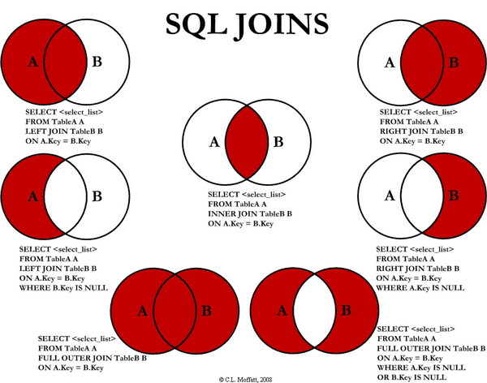
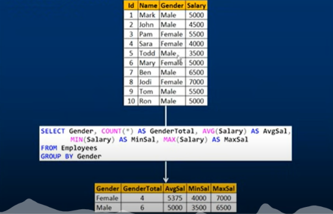
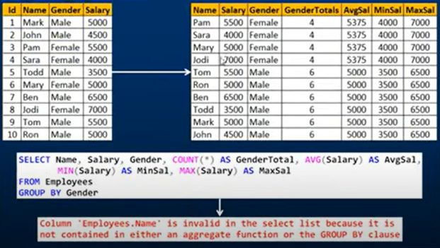
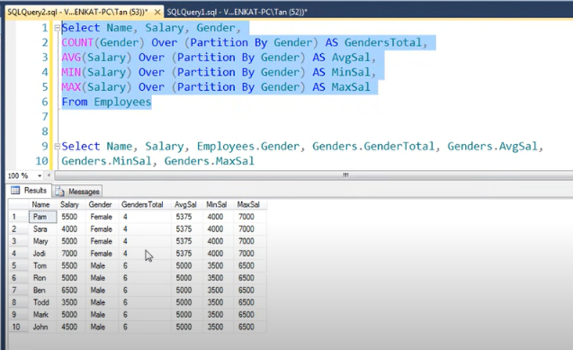
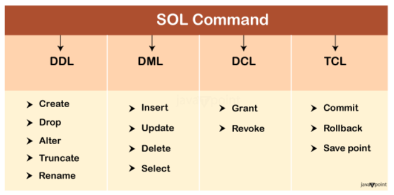

# Queries

## Basics

### Creating Table and Inserting Values

- SQL Queries

```
CREATE TABLE EMPLOYEE (
  empId int primary key,
  name varchar(15) not null,
  dept varchar(10),
  Salary numeric(18,4) not null -- 18 digits before decimal and 4 digits after decimal
);


INSERT INTO EMPLOYEE(empId,name,dept,Salary) VALUES (1, 'Clark', 'Sales',1000),(2, 'Dave', 'Accounting',2000)
, (3, 'Ava', 'Sales',3000),(4, 'ABC', 'Sales',4000),(5, 'BCD', 'Sales',5000),(6, 'XYZ', null,4000.988888);


SELECT * FROM EMPLOYEE; Go
```

- Output:

```
Output:

empId       name            dept       Salary              
----------- --------------- ---------- --------------------
          1 Clark           Sales                 1000.0000
          2 Dave            Accounting            2000.0000
          3 Ava             Sales                 3000.0000
          4 ABC             Sales                 4000.0000
          5 BCD             Sales                 5000.0000
          6 XYZ             NULL                  4000.9889
```

### Adding Foreign Key

- A foreign key is a key whose values are derived from the Primary key of another table.
- The table from which the values are derived is known as **Master or Referenced Table** and the Table in which values are inserted accordingly is known as **Child or Referencing Table**, In other words, we can say that the table containing the foreign key is called the **child table**, and the table containing the Primary key/candidate key is called the **referenced or parent table**.

- SQL Queries

```
-- Child Table
create table gender(
  id int primary key,
  name varchar(7) not null
);

-- Employee Master Table
alter table EMPLOYEE add constraint gender_as_FK foreign key (gender) references gender(id); -- Foreign Key

insert into gender(id,name) VALUES (1,"Male"),(2,"Female"),(3,"Others");

INSERT INTO EMPLOYEE(empId,name,dept,Salary,gender) VALUES (1, 'Clark', 'Sales',1000,1),(2, 'Dave', 'Accounting',2000,1)
, (3, 'Ava', 'Sales',3000,2),(4, 'ABC', 'Sales',4000,3),(5, 'BCD', 'Sales',5000,3),(6, 'XYZ', null,4000.988888,3);

select * from EMPLOYEE;

insert into EMPLOYEE values (7,"ABC",null,100,100); -- Cannot insert 100 because it does not exists in gender table because it has a foreign key relationship
```

- Output

```
Output:

empId       name            dept       Salary               gender     
----------- --------------- ---------- -------------------- -----------
          1 Clark           Sales                 1000.0000           1
          2 Dave            Accounting            2000.0000           1
          3 Ava             Sales                 3000.0000           2
          4 ABC             Sales                 4000.0000           3
          5 BCD             Sales                 5000.0000           3
          6 XYZ             NULL                  4000.9889           3
Msg 547, Level 16, State 1, Server 5a0ee01082d2, Line 33
The INSERT statement conflicted with the FOREIGN KEY constraint "gender_as_FK". The conflict occurred in database "db_42whkr33r_42wj5jgzn", table "dbo.gender", column 'id'.
The statement has been terminated.
```

### Adding default constraint or removing it

- SQL Queries

```
alter table gender add constraint default_value_for_gender default "Not Assigned" for name;
insert into gender(id) values (4);
select * from gender;
```

- Output

```
id          name           
----------- ---------------
          1 Male           
          2 Female         
          3 Others         
          4 Not Assigned  
```

- To remove

```
alter table gender drop constraint default_value_for_gender
```

### Adding or removing a column

- SQL Queries for Adding

```
Alter table to add a new column
alter table employee add phone varchar(20) not null default "Not Provided";
select * from employee;
```

- Output

```
empId       name            dept       Salary               gender      phone               
----------- --------------- ---------- -------------------- ----------- --------------------
          1 Clark           Sales                 1000.0000           1 Not Provided        
          2 Dave            Accounting            2000.0000           1 Not Provided        
          3 Ava             Sales                 3000.0000           2 Not Provided        
          4 ABC             Sales                 4000.0000           3 Not Provided        
          5 BCD             Sales                 5000.0000           3 Not Provided        
          6 XYZ             NULL                  4000.9889           3 Not Provided        
```

- SQL Queries for removing

>[!NOTE]
> - Before removing any column, if the column is associated with any constraint we need to delete that constraint first then delete the column or else we wil receive an error `ALTER TABLE DROP COLUMN phone failed because one or more objects access this column.`

```
alter table employee drop column phone ;
select * from employee;
```

- Output error

```
Msg 5074, Level 16, State 1, Server ba53ca26b538, Line 41
The object 'DF__EMPLOYEE__phone__3B75D760' is dependent on column 'phone'.
Msg 4922, Level 16, State 9, Server ba53ca26b538, Line 41
ALTER TABLE DROP COLUMN phone failed because one or more objects access this column.
```

- Updated query

```
alter table employee drop constraint DF__EMPLOYEE__phone__3B75D760;
alter table employee drop column phone ;
select * from employee
```

- Output

```
empId       name            dept       Salary               gender     
----------- --------------- ---------- -------------------- -----------
          1 Clark           Sales                 1000.0000           1
          2 Dave            Accounting            2000.0000           1
          3 Ava             Sales                 3000.0000           2
          4 ABC             Sales                 4000.0000           3
          5 BCD             Sales                 5000.0000           3
          6 XYZ             NULL                  4000.9889           3
```


### Cascading Referential Integrity OR Referential Integrity

- Referential integrity is usually enforced by creating a foreign key in one table that matches the primary key of another table. **If referential integrity is not enforced, then you may encounter data redundancy and inconsistencies.**
- Consider below SQL Query

```
-- create
CREATE TABLE EMPLOYEE (
  empId int primary key,
  name varchar(15) not null,
  dept varchar(10),
  Salary numeric(18,4) not null,
  gender int
);


create table gender(
  id int primary key,
  name varchar(15)
);

alter table EMPLOYEE add constraint gender_as_FK foreign key (gender) references gender(id);

insert into gender(id,name) VALUES (1,"Male"),(2,"Female"),(3,"Others");


-- insert
INSERT INTO EMPLOYEE(empId,name,dept,Salary,gender) VALUES (1, 'Clark', 'Sales',1000,1),(2, 'Dave', 'Accounting',2000,1)
, (3, 'Ava', 'Sales',3000,2),(4, 'ABC', 'Sales',4000,3),(5, 'BCD', 'Sales',5000,3),(6, 'XYZ', null,4000.988888,3);


alter table gender add constraint default_value_for_gender default "Not Assigned" for name;

select * from EMPLOYEE;
select * from gender;
```

- Output

```
Output:

empId       name            dept       Salary               gender     
----------- --------------- ---------- -------------------- -----------
          1 Clark           Sales                 1000.0000           1
          2 Dave            Accounting            2000.0000           1
          3 Ava             Sales                 3000.0000           2
          4 ABC             Sales                 4000.0000           3
          5 BCD             Sales                 5000.0000           3
          6 XYZ             NULL                  4000.9889           3
id          name           
----------- ---------------
          1 Male           
          2 Female         
          3 Others   
```

- Now suppose you don't create foreign key and you delete any `id` from `gender` table. The corresponding ID's are still present in  `employee` table. This leads to data inconsistencies. You need to manually delete those data from `employee` table. 
- Due to referential integrity, if you try to delete any row from the child table (`gender`) you will get `The DELETE statement conflicted with the REFERENCE constraint "gender_as_FK". The conflict occurred in database "db_42whkr55c_42wjgrfaq", table "dbo.EMPLOYEE", column 'gender'. The statement has been terminated.` such type of error.
- But if you wanna delete the data you need to set some default values or tell SQL Server to these those records from other table as well (`CASCADE`)

#### Setting Default Value

- Consider below SQL Queries

```
-- create
CREATE TABLE EMPLOYEE (
  empId int primary key,
  name varchar(15) not null,
  dept varchar(10),
  Salary numeric(18,4) not null,
  gender int
);


create table gender(
  id int primary key,
  name varchar(15)
);

-- Insert
INSERT INTO EMPLOYEE(empId,name,dept,Salary,gender) VALUES (1, 'Clark', 'Sales',1000,1),(2, 'Dave', 'Accounting',2000,1)
, (3, 'Ava', 'Sales',3000,2),(4, 'ABC', 'Sales',4000,3),(5, 'BCD', 'Sales',5000,3),(6, 'XYZ', null,4000.988888,3);
insert into gender(id,name) VALUES (1,"Male"),(2,"Female"),(3,"Others");

-- Adding foreign key
ALTER TABLE EMPLOYEE
ADD CONSTRAINT gender_as_FK FOREIGN KEY (gender) -- gender column of Employee table
REFERENCES gender(id) -- gender(id) , id column if gender table
ON DELETE SET default;

-- Adding constraint on gender table
alter table gender add constraint default_value_for_gender default "Not Assigned" for name;

-- Adding constraint on employee table's gender column setting some default value for gender column
alter table employee add CONSTRAINT default_gender_id default 3 for gender;

-- Deleting id=1 from gender table
delete from gender where id=1;

select * from gender;
select * from EMPLOYEE;
```

- Here whatever the default value assigned for column `gender` (which is 3 `alter table employee add CONSTRAINT default_gender_id default 3 for gender;`) gets assigned if the Foreign key from the `gender` table is deleted.
- Output

```
Output:

id          name           
----------- ---------------
          2 Female         
          3 Others         
empId       name            dept       Salary               gender     
----------- --------------- ---------- -------------------- -----------
          1 Clark           Sales                 1000.0000           3
          2 Dave            Accounting            2000.0000           3
          3 Ava             Sales                 3000.0000           2
          4 ABC             Sales                 4000.0000           3
          5 BCD             Sales                 5000.0000           3
          6 XYZ             NULL                  4000.9889           3
```

### Setting Default value as `NULL`

- Similarly like above where we assigned 3 as default value, SQL server will assigned directly `NULL` value. You don't need to create default value constraint on `employee` table's `gender` column.

```


-- create
CREATE TABLE EMPLOYEE (
  empId int primary key,
  name varchar(15) not null,
  dept varchar(10),
  Salary numeric(18,4) not null,
  gender int
);


create table gender(
  id int primary key,
  name varchar(15)
);

-- Insert
INSERT INTO EMPLOYEE(empId,name,dept,Salary,gender) VALUES (1, 'Clark', 'Sales',1000,1),(2, 'Dave', 'Accounting',2000,1)
, (3, 'Ava', 'Sales',3000,2),(4, 'ABC', 'Sales',4000,3),(5, 'BCD', 'Sales',5000,3),(6, 'XYZ', null,4000.988888,3);
insert into gender(id,name) VALUES (1,"Male"),(2,"Female"),(3,"Others");

-- Adding foreign key
ALTER TABLE EMPLOYEE
ADD CONSTRAINT gender_as_FK FOREIGN KEY (gender) -- gender column of Employee table
REFERENCES gender(id) -- gender(id) , id column if gender table
ON DELETE SET NULL;

-- Adding constraint on gender table
alter table gender add constraint default_value_for_gender default "Not Assigned" for name;


-- Deleting id=1 from gender table
delete from gender where id=1;

select * from gender;
select * from EMPLOYEE;
```

- Output

```
Output:

id          name           
----------- ---------------
          2 Female         
          3 Others         
empId       name            dept       Salary               gender     
----------- --------------- ---------- -------------------- -----------
          1 Clark           Sales                 1000.0000        NULL
          2 Dave            Accounting            2000.0000        NULL
          3 Ava             Sales                 3000.0000           2
          4 ABC             Sales                 4000.0000           3
          5 BCD             Sales                 5000.0000           3
          6 XYZ             NULL                  4000.9889           3
```

### Delete Cascade

- Lets say when you wanted to remove data from `gender` table but also you want all the related id which corresponds to the data which needs to be deleted, must also be deleted.

```


-- create
CREATE TABLE EMPLOYEE (
  empId int primary key,
  name varchar(15) not null,
  dept varchar(10),
  Salary numeric(18,4) not null,
  gender int
);


create table gender(
  id int primary key,
  name varchar(15)
);

-- Insert
INSERT INTO EMPLOYEE(empId,name,dept,Salary,gender) VALUES (1, 'Clark', 'Sales',1000,1),(2, 'Dave', 'Accounting',2000,1)
, (3, 'Ava', 'Sales',3000,2),(4, 'ABC', 'Sales',4000,3),(5, 'BCD', 'Sales',5000,3),(6, 'XYZ', null,4000.988888,3);
insert into gender(id,name) VALUES (1,"Male"),(2,"Female"),(3,"Others");

-- Adding foreign key
ALTER TABLE EMPLOYEE
ADD CONSTRAINT gender_as_FK FOREIGN KEY (gender) -- gender column of Employee table
REFERENCES gender(id) -- gender(id) , id column if gender table
ON DELETE CASCADE;

-- Adding constraint on gender table
alter table gender add constraint default_value_for_gender default "Not Assigned" for name;


-- Deleting id=1 from gender table
delete from gender where id=1;

select * from gender;
select * from EMPLOYEE;
```

- Output

```
Output:

id          name           
----------- ---------------
          2 Female         
          3 Others         
empId       name            dept       Salary               gender     
----------- --------------- ---------- -------------------- -----------
          3 Ava             Sales                 3000.0000           2
          4 ABC             Sales                 4000.0000           3
          5 BCD             Sales                 5000.0000           3
          6 XYZ             NULL                  4000.9889           3
```

### CHECK Constraint

- A CHECK constraint in SQL Server is used to limit the values that can be entered into a column, ensuring they meet specified conditions. For example, we can use a CHECK constraint to enforce that values in an `age` column must be between `18` and `100`.

```
-- create
CREATE TABLE EMPLOYEE (
  empId int primary key,
  name varchar(15) not null,
  dept varchar(10),
  Salary numeric(18,4) not null,
  gender int
);


-- Add a new column 'age' with a CHECK constraint
ALTER TABLE EMPLOYEE
ADD age INT CHECK (age > 18 AND age < 100);

-- Insert sample data to test the constraint
INSERT INTO EMPLOYEE(empId,name,dept,Salary,gender,age) VALUES (1, 'Clark', 'Sales',1000,1,20);

INSERT INTO EMPLOYEE(empId, name, dept, Salary, gender, age)
VALUES 
(2, 'John', 'Marketing', 2500, 1, 25);

-- Verify the table structure and data
SELECT * FROM EMPLOYEE;

```

- Output

```
Output:

empId       name            dept       Salary               gender      age        
----------- --------------- ---------- -------------------- ----------- -----------
          1 Clark           Sales                 1000.0000           1          20
          2 John            Marketing             2500.0000           1          25
```

- If you try to add value which are beyond the age. You will get error

```
Msg 547, Level 16, State 1, Server 899a7718fee7, Line 21
The INSERT statement conflicted with the CHECK constraint "CK__EMPLOYEE__age__37A5467C". The conflict occurred in database "db_42whkr583_42wjjwthf", table "dbo.EMPLOYEE", column 'age'.
The statement has been terminated.
```

>[!NOTE]
> - Since we have allowed `NULL` values , the `NULL` values will be accepted during any insertion for `age` column.

### Identity Column

- An `IDENTITY` column in SQL Server is used to auto-generate unique numbers for each new row in a table. When you define a column as an IDENTITY, SQL Server automatically assigns an incrementing integer value to it, which can serve as a unique identifier for each row.

```
CREATE TABLE EMPLOYEE (
  empId INT IDENTITY(1,1) PRIMARY KEY,
  name VARCHAR(15) NOT NULL,
  dept VARCHAR(10),
  Salary NUMERIC(18,4) NOT NULL,
  gender INT
);


insert into EMPLOYEE(name,dept,Salary,gender) Values ("ABC","IT",1000,1);

select * from EMPLOYEE;
```

- Output


```
Output:

empId       name            dept       Salary               gender     
----------- --------------- ---------- -------------------- -----------
          1 ABC             IT                    1000.0000           1
```

- When we insert data into `employee` table, we don't need to pass value for `empid` column, it gets automatically generated. `IDENTITY(1,1)` means starting from the value 1 (first insert will have ID as 1) and incrementing by 1 with each new row insertion.
- If you try to enter the value explicitly , you will get an error

```
insert into EMPLOYEE(empId,name,dept,Salary,gender) Values (2,"BCD","IT",1000,1);
```

- Output

```
Cannot insert explicit value for identity column in table 'EMPLOYEE' when IDENTITY_INSERT is set to OFF.
```

- If you wanna explicitly pass on the ID you can use `set IDENTITY_INSERT EMPLOYEE ON;`, **so whenever you are inserting value into the table it won't auto generate unique id, instead it gonna expect id from you**.

```
insert into EMPLOYEE(empId,name,dept,Salary,gender) Values (2,"BCD","IT",1000,1);
```

- Output

```
Output:

empId       name            dept       Salary               gender     
----------- --------------- ---------- -------------------- -----------
          1 ABC             IT                    1000.0000           1
          2 BCD             IT                    1000.0000           1
```

#### Differences Between an Identity Column and a Primary Key


| **Feature**            | **Identity Column**                                         | **Primary Key Column**                                            |
|------------------------|-------------------------------------------------------------|-------------------------------------------------------------------|
| **Purpose**            | Automatically generates a unique numeric value for each row | Enforces uniqueness across rows in the table                      |
| **Auto-increment**     | Yes, it automatically increments by a specified amount      | No, it doesn’t automatically generate values                      |
| **Uniqueness**         | Values are unique if properly defined (no manual inserts)   | Must be unique; allows non-numeric values                         |
| **Required Data Type** | Must be a numeric type (typically INT, BIGINT)              | Can be any data type                                              |
| **Nullability**        | Cannot be null, as it provides unique values                | Cannot be null (required by primary key constraint)               |
| **Usage Flexibility**  | Primarily used for numeric, auto-generated identifiers      | Can be a composite key, combining multiple columns for uniqueness |


>[!NOTE]
> -  A table in SQL Server can only have one `IDENTITY` column. This restriction exists because an IDENTITY column is designed to automatically generate unique values for each new row, which is typically intended to uniquely identify rows in a straightforward, sequential manner.

### Unique Constraint

- There could be scenario where you applied primary key on a table which has employee information like mobile number, aadhar number, email id etc.. So lets say if you applied primary key on mobile number, the uniqueness for email id and aadhar number is still not defined. In such case, you wanted to define uniqueness to email id and aadhar number you can create **unique constraint** on it.

```
alter table EMPLOYEE add email_id varchar(20);

alter table EMPLOYEE add constraint unique_email_id unique (email_id);
```

#### Difference between unique constraint and primary key

| **Feature**                | **UNIQUE Constraint**                                          | **PRIMARY KEY**                               |
|----------------------------|----------------------------------------------------------------|-----------------------------------------------|
| **Purpose**                | Ensures that values are unique across all rows in a column     | Uniquely identifies each row in a table       |
| **Uniqueness Requirement** | Values must be unique, but allows NULL values                  | Must be unique and cannot contain NULL values |
| **NULL Values**            | Allows one NULL per column (some databases may allow multiple) | Does not allow NULL values                    |
| **Number per Table**       | A table can have multiple UNIQUE constraints                   | A table can have only one PRIMARY KEY         |


### Manipulation in Select Queries 

- Lets create a table and insert some values.

```
-- Create a temporary table
CREATE TABLE EmployeeTemp (
    empId INT,
    name VARCHAR(15),
    dept VARCHAR(10),
    salary NUMERIC(18, 2),
    age INT,
    gender CHAR(1)
);

-- Insert sample data into the temporary table
INSERT INTO #EmployeeTemp (empId, name, dept, salary, age, gender)
VALUES 
(1, 'Clark', 'Sales', 1000.50, 25, 'M'),
(2, 'Alice', 'HR', 2000.75, 30, 'F'),
(3, 'Bob', 'Marketing', 1500.25, 35, 'M'),
(4, 'Eve', 'Finance', 2500.00, 28, 'F'),
(5, 'John', 'Sales', 1800.50, 22, 'M');
```

- Display all the data

```
select * from EmployeeTemp;
```

- Output

```
Output:

empId       name            dept       salary               age         gender
----------- --------------- ---------- -------------------- ----------- ------
          1 Clark           Sales                   1000.50          25 M     
          2 Alice           HR                      2000.75          30 F     
          3 Bob             Marketing               1500.25          35 M     
          4 Eve             Finance                 2500.00          28 F     
          5 John            Sales                   1800.50          22 M     
```

- Perform Logical Operation (`AND` or `OR`).

```
-- Select male employees in the Sales department
SELECT * FROM EmployeeTemp WHERE gender = 'M' AND dept = 'Sales';

-- Select employees in Sales or with a salary greater than 2000
SELECT * FROM EmployeeTemp WHERE dept = 'Sales' OR salary > 2000;
```

- Output

```
Output:

empId       name            dept       salary               age         gender
----------- --------------- ---------- -------------------- ----------- ------
          1 Clark           Sales                   1000.50          25 M     
          5 John            Sales                   1800.50          22 M     
empId       name            dept       salary               age         gender
----------- --------------- ---------- -------------------- ----------- ------
          1 Clark           Sales                   1000.50          25 M     
          2 Alice           HR                      2000.75          30 F     
          4 Eve             Finance                 2500.00          28 F     
          5 John            Sales                   1800.50          22 M     
```

- Using `!=` and `<>` (Not Equal)

```
-- Select employees who are not in the Sales department
SELECT * FROM EmployeeTemp WHERE dept != 'Sales';

-- Alternative syntax
SELECT * FROM EmployeeTemp WHERE dept <> 'Sales';
```

- Output

```
Output:

empId       name            dept       salary               age         gender
----------- --------------- ---------- -------------------- ----------- ------
          2 Alice           HR                      2000.75          30 F     
          3 Bob             Marketing               1500.25          35 M     
          4 Eve             Finance                 2500.00          28 F     
empId       name            dept       salary               age         gender
----------- --------------- ---------- -------------------- ----------- ------
          2 Alice           HR                      2000.75          30 F     
          3 Bob             Marketing               1500.25          35 M     
          4 Eve             Finance                 2500.00          28 F     
```

- Finding a range using `BETWEEN`

```
-- Select employees with age between 25 and 30
SELECT * FROM EmployeeTemp WHERE age BETWEEN 25 AND 30;
```

- Output

```
Output:

empId       name            dept       salary               age         gender
----------- --------------- ---------- -------------------- ----------- ------
          1 Clark           Sales                   1000.50          25 M     
          2 Alice           HR                      2000.75          30 F     
          4 Eve             Finance                 2500.00          28 F     
```

- Find those rows which existing in the group of values


```
-- Select employees in the Sales or HR departments
SELECT * FROM EmployeeTemp WHERE dept IN ('Sales', 'HR');
```

- Output

```
Output:

empId       name            dept       salary               age         gender
----------- --------------- ---------- -------------------- ----------- ------
          1 Clark           Sales                   1000.50          25 M     
          2 Alice           HR                      2000.75          30 F     
          5 John            Sales                   1800.50          22 M     
```

- Using greater than or less than or greater than/less than and equal to

```
-- Select employees with a salary greater than 1500
SELECT * FROM EmployeeTemp WHERE salary > 1500;

-- Select employees with an age less than 30 and equal to 30
SELECT * FROM EmployeeTemp WHERE age <= 30;
```

- Output

```
Output:

empId       name            dept       salary               age         gender
----------- --------------- ---------- -------------------- ----------- ------
          2 Alice           HR                      2000.75          30 F     
          3 Bob             Marketing               1500.25          35 M     
          4 Eve             Finance                 2500.00          28 F     
          5 John            Sales                   1800.50          22 M     
empId       name            dept       salary               age         gender
----------- --------------- ---------- -------------------- ----------- ------
          1 Clark           Sales                   1000.50          25 M     
          2 Alice           HR                      2000.75          30 F     
          4 Eve             Finance                 2500.00          28 F     
          5 John            Sales                   1800.50          22 M     
```

- Pattern matching

```
-- Select employees whose name starts with 'C'
SELECT * FROM EmployeeTemp WHERE name LIKE 'C%';

-- Select employees whose department ends with 'e'
SELECT * FROM EmployeeTemp WHERE dept LIKE '%e';

-- Select employees whose department contains `a`
SELECT * FROM EmployeeTemp WHERE dept LIKE '%a%';
```

- Output

```
Output:

empId       name            dept       salary               age         gender
----------- --------------- ---------- -------------------- ----------- ------
          1 Clark           Sales                   1000.50          25 M     
empId       name            dept       salary               age         gender
----------- --------------- ---------- -------------------- ----------- ------
          4 Eve             Finance                 2500.00          28 F     
empId       name            dept       salary               age         gender
----------- --------------- ---------- -------------------- ----------- ------
          1 Clark           Sales                   1000.50          25 M     
          3 Bob             Marketing               1500.25          35 M     
          4 Eve             Finance                 2500.00          28 F     
          5 John            Sales                   1800.50          22 M     
```

- The `%` character is use to find one or more character after or before the specified character.
- The `_` character is use to find exactly one character after or before the specified character.

```
-- Select employees whose department has one word before `R`, so `HR`
SELECT * FROM EmployeeTemp WHERE dept LIKE '_R';

-- Select employees whose department has one word before `a` and any or zero characters after `a`'
SELECT * FROM EmployeeTemp WHERE dept LIKE '_a%';
```

- Output

```
Output:

empId       name            dept       salary               age         gender
----------- --------------- ---------- -------------------- ----------- ------
          2 Alice           HR                      2000.75          30 F     
empId       name            dept       salary               age         gender
----------- --------------- ---------- -------------------- ----------- ------
          1 Clark           Sales                   1000.50          25 M     
          3 Bob             Marketing               1500.25          35 M     
          5 John            Sales                   1800.50          22 M     
```

- The `[]` represents any single character within the brackets 
- The `[^]` represents any character not in the brackets

```
-- Select employees whose department start with `Sa`
SELECT * FROM EmployeeTemp WHERE dept LIKE '[Sa]%';


-- Select employees whose department does not start with `Sa`
SELECT * FROM EmployeeTemp WHERE dept LIKE '[^Sa]%';
```

- Output

```
Output:

empId       name            dept       salary               age         gender
----------- --------------- ---------- -------------------- ----------- ------
          1 Clark           Sales                   1000.50          25 M     
          5 John            Sales                   1800.50          22 M     
empId       name            dept       salary               age         gender
----------- --------------- ---------- -------------------- ----------- ------
          2 Alice           HR                      2000.75          30 F     
          3 Bob             Marketing               1500.25          35 M     
          4 Eve             Finance                 2500.00          28 F     
```

- Sorting

```
-- Select employees by sorting in ascending order of name
SELECT * FROM EmployeeTemp order by name;

-- Select employees by sorting in descending order of name
SELECT * FROM EmployeeTemp order by name desc;
```

- Output

```
Output:

empId       name            dept       salary               age         gender
----------- --------------- ---------- -------------------- ----------- ------
          2 Alice           HR                      2000.75          30 F     
          3 Bob             Marketing               1500.25          35 M     
          1 Clark           Sales                   1000.50          25 M     
          4 Eve             Finance                 2500.00          28 F     
          5 John            Sales                   1800.50          22 M     
empId       name            dept       salary               age         gender
----------- --------------- ---------- -------------------- ----------- ------
          5 John            Sales                   1800.50          22 M     
          4 Eve             Finance                 2500.00          28 F     
          1 Clark           Sales                   1000.50          25 M     
          3 Bob             Marketing               1500.25          35 M     
          2 Alice           HR                      2000.75          30 F     
```

- Fetch top 1st row

```
-- Select Top 1
SELECT TOP 1 * FROM EmployeeTemp;

-- Select TOP 50% data from table (5/2+1=3 rows)
SELECT TOP 50 percent * FROM EmployeeTemp;
```

- Output

```
Output:

empId       name            dept       salary               age         gender
----------- --------------- ---------- -------------------- ----------- ------
          1 Clark           Sales                   1000.50          25 M     
empId       name            dept       salary               age         gender
----------- --------------- ---------- -------------------- ----------- ------
          1 Clark           Sales                   1000.50          25 M     
          2 Alice           HR                      2000.75          30 F     
          3 Bob             Marketing               1500.25          35 M    
```

### Aggregate Functions

- An aggregate function is a function that performs a calculation on a set of values, and returns a single value.
- Aggregate functions are often used with the `GROUP BY` clause of the `SELECT` statement. The `GROUP BY` clause splits the result-set into groups of values and the aggregate function can be used to return a single value for each group.

```
-- Select average salary given for gender (M & F)
select gender,avg(salary) from EmployeeTemp group by gender;

-- Select max salary given for gender (M & F)
select gender,max(salary) from EmployeeTemp group by gender;

-- Select min salary given for gender (M & F)
select gender,min(salary) from EmployeeTemp group by gender;

-- Select sum of salary given for gender (M & F)
select gender,sum(salary) from EmployeeTemp group by gender;


-- Find the number of genders
select gender,count(gender) from EmployeeTemp group by gender;

```

- Output

```
Output:

gender                                         
------ ----------------------------------------
F                                   2250.375000
M                                   1433.750000
gender                     
------ --------------------
F                   2500.00
M                   1800.50
gender                     
------ --------------------
F                   2000.75
M                   1000.50
gender                                         
------ ----------------------------------------
F                                       4500.75
M                                       4301.25
gender            
------ -----------
F                2
M                3
```

>[!NOTE]
> - Aggregate functions ignore `NULL` values (except for `COUNT()` function).

#### Having and Where clause

- Consider below queries

```
CREATE TABLE Sales (
    sale_id INT,
    item VARCHAR(20),
    quantity INT,
    price DECIMAL(10, 2),
    department VARCHAR(20)
);

-- Insert sample data
INSERT INTO Sales (sale_id, item, quantity, price, department)
VALUES
(1, 'Laptop', 2, 1200.00, 'Electronics'),
(2, 'TV', 1, 800.00, 'Electronics'),
(3, 'Shoes', 3, 100.00, 'Clothing'),
(4, 'Jacket', 1, 150.00, 'Clothing'),
(5, 'Laptop', 1, 1200.00, 'Electronics'),
(6, 'Laptop', 1, 1200.00, 'Electronics');


-- Group by departments
SELECT department, SUM(quantity) AS total_quantity
FROM Sales
GROUP BY department;

-- Select those rows, first perform group by then filter than on it using having clause
SELECT department, SUM(quantity) AS total_quantity
FROM Sales
GROUP BY department
having sum(quantity)>4;
```

- Output

```
Output:

department           total_quantity
-------------------- --------------
Clothing                          4
Electronics                       5
department           total_quantity
-------------------- --------------
Electronics                       5
```

- If we want to first filter out certain rows (using `WHERE`) and then apply aggregation conditions (using `HAVING`), we can combine both clauses.
- `HAVING` Clause:
  - Filters after aggregation has taken place.
  - Applies conditions to aggregated results (e.g., groups created by GROUP BY).
  - Typically used with aggregate functions.
- `WHERE` Clause:
  - Filters rows before any aggregation occurs.
  - Applies conditions to individual rows.
  - Cannot use aggregate functions directly (E.g `select * from Sales where sum(quantity)>4` this is invalid because we can't use `sum` aggregate function directly in `WHERE` clause)


### Joins

- The join clause allows us to retrieve data from two or more related tables into a meaningful result set. We can join the table using a SELECT statement and a join condition. It indicates how SQL Server can use data from one table to select rows from another table.
- Consider below query

```
-- Employee table
CREATE TABLE Employee (
    empId INT,
    name VARCHAR(15),
    deptId INT
);

INSERT INTO Employee (empId, name, deptId)
VALUES
(1, 'Clark', 101),
(2, 'Alice', 102),
(3, 'Bob', NULL),
(4, 'Eve', 104);

-- Department table
CREATE TABLE Department (
    deptId INT,
    deptName VARCHAR(15)
);

INSERT INTO Department (deptId, deptName)
VALUES
(101, 'Sales'),
(102, 'HR'),
(103, 'IT');

select * from Employee;
select * from Department;
```

- Output

```
Output:

empId       name            deptId     
----------- --------------- -----------
          1 Clark                   101
          2 Alice                   102
          3 Bob                    NULL
          4 Eve                     104
deptId      deptName       
----------- ---------------
        101 Sales          
        102 HR             
        103 IT  
```

#### INNER JOIN or JOIN

- An INNER JOIN returns rows when there is a match in both tables. If no match is found, the row is excluded.

```
SELECT e.empId, e.name, d.deptName
FROM Employee e
INNER JOIN Department d ON e.deptId = d.deptId;

OR

SELECT e.empId, e.name, d.deptName
FROM Employee e
JOIN Department d ON e.deptId = d.deptId;
```

- Output

```
Output:

empId       name            deptName       
----------- --------------- ---------------
          1 Clark           Sales          
          2 Alice           HR    
```

#### LEFT JOIN or LEFT OUTER JOIN

- A LEFT JOIN (or LEFT OUTER JOIN) returns all rows from the left table and the matched rows from the right table. If there is no match, `NULL` values are returned for columns from the right table.

```
SELECT e.empId, e.name, d.deptName
FROM Employee e
LEFT JOIN Department d ON e.deptId = d.deptId;

OR

SELECT e.empId, e.name, d.deptName
FROM Employee e
LEFT OUTER JOIN Department d ON e.deptId = d.deptId;
```

- Output

```
Output:

empId       name            deptName       
----------- --------------- ---------------
          1 Clark           Sales          
          2 Alice           HR             
          3 Bob             NULL           
          4 Eve             NULL  
```

- Lets say you wanna find out the names of the employee which does not have department name

```
SELECT e.empId, e.name, d.deptName
FROM Employee e
LEFT OUTER JOIN Department d ON e.deptId = d.deptId where d.deptId is null;
```

- Output

```
Output:

empId       name            deptName       
----------- --------------- ---------------
          3 Bob             NULL    
          4 Eve             NULL           
```


#### RIGHT JOIN or RIGHT OUTER JOIN

- A RIGHT JOIN (or RIGHT OUTER JOIN) returns all rows from the right table and the matched rows from the left table. If there is no match, `NULL` values are returned for columns from the left table.

```
SELECT e.empId, e.name, d.deptName
FROM Employee e
RIGHT JOIN Department d ON e.deptId = d.deptId;

OR

SELECT e.empId, e.name, d.deptName
FROM Employee e
RIGHT OUTER JOIN Department d ON e.deptId = d.deptId;
```

- Output

```
Output:

empId       name            deptName       
----------- --------------- ---------------
          1 Clark           Sales          
          2 Alice           HR             
       NULL NULL            IT             
```

- Lets say we only want to retrieve the department name which is not mapped to employee

```
SELECT e.empId, e.name, d.deptName
FROM Employee e
RIGHT JOIN Department d ON e.deptId = d.deptId where e.deptId is null;
```

- Output

```
Output:

empId       name            deptName       
----------- --------------- ---------------
       NULL NULL            IT 
```

#### FULL JOIN or FULL OUTER JOIN

- A FULL JOIN (or FULL OUTER JOIN) returns all rows when there is a match in either the left or right table. Rows that do not have matches in either table will contain `NULL` values for the missing data.

```
SELECT e.empId, e.name, d.deptName
FROM Employee e
FULL JOIN Department d ON e.deptId = d.deptId;

OR

SELECT e.empId, e.name, d.deptName
FROM Employee e
FULL OUTER JOIN Department d ON e.deptId = d.deptId;
```

- Output

```
Output:

empId       name            deptName       
----------- --------------- ---------------
          1 Clark           Sales          
          2 Alice           HR             
          3 Bob             NULL           
          4 Eve             NULL           
       NULL NULL            IT  
```

- Now lets say we want the employee who does not have department mapped and name of department as well which are not mapped to employees

```

SELECT e.empId, e.name, d.deptName
FROM Employee e
FULL OUTER JOIN Department d ON e.deptId = d.deptId where e.deptId is null OR d.deptId is null;
```

- Output

```
Output:

empId       name            deptName       
----------- --------------- ---------------
          3 Bob             NULL           
          4 Eve             NULL           
       NULL NULL            IT 
```


#### Summary (RIGHT, LEFT, INNER and FULL Join)



#### CROSS JOIN

- A CROSS JOIN combines every row from one table with every row from another table, regardless of any relationship or matching condition. Think of it as pairing each item in the first table with every item in the second table, producing a Cartesian product.
- Let’s say you have two tables with data:

| empId | name  |
|-------|-------|
| 1     | Clark |
| 2     | Ava   |


- Another table

| deptId | deptName |
|--------|----------|
| 101    | Sales    |
| 102    | HR       |

- When you CROSS JOIN these tables, you get every possible combination

| empId | name  | deptId | deptName |
|-------|-------|--------|----------|
| 1     | Clark | 101    | Sales    |
| 1     | Clark | 102    | HR       |
| 2     | Ava   | 101    | Sales    |

- Query

```
SELECT e.empId, e.name, d.deptId, d.deptName
FROM Employee e
CROSS JOIN Department d;
```

- Output

```
Output:

empId       name            deptId      deptName       
----------- --------------- ----------- ---------------
          1 Clark                   101 Sales          
          2 Alice                   101 Sales          
          3 Bob                     101 Sales          
          4 Eve                     101 Sales          
          1 Clark                   102 HR             
          2 Alice                   102 HR             
          3 Bob                     102 HR             
          4 Eve                     102 HR             
          1 Clark                   103 IT             
          2 Alice                   103 IT             
          3 Bob                     103 IT             
          4 Eve                     103 IT   
```

#### SELF JOIN

- A SELF JOIN is when a table is joined with itself. This can be helpful when you need to compare rows in a single table. For example, if you want to find pairs of employees from the same department, you can join the Employee table with itself.
- A self join is a regular join, but the table is joined with itself.
- Suppose we have a company with employees who might have managers.

```
CREATE TABLE Employee (
    empId INT PRIMARY KEY,
    name VARCHAR(50) NOT NULL,
    managerId INT NULL,
    FOREIGN KEY (managerId) REFERENCES Employee(empId)  -- Self-referencing foreign key
);

INSERT INTO Employee (empId, name, managerId) VALUES
(1, 'Clark', NULL),  -- Clark is the top-level manager (CEO)
(2, 'Ava', 1),       -- Ava reports to Clark
(3, 'Bob', 1),       -- Bob reports to Clark
(4, 'Eve', 2),       -- Eve reports to Ava
(5, 'David', 2),     -- David reports to Ava
(6, 'Mary', 3);      -- Mary reports to Bob


select * from Employee;

SELECT 
    e1.empId AS EmployeeId,
    e1.name AS EmployeeName,
    e2.empId AS ManagerId,
    e2.name AS ManagerName
FROM 
    Employee e1
 JOIN 
    Employee e2 ON e1.managerId = e2.empId;
```

- Output

```
Output:

empId       name                                               managerId  
----------- -------------------------------------------------- -----------
          1 Clark                                                     NULL
          2 Ava                                                          1
          3 Bob                                                          1
          4 Eve                                                          2
          5 David                                                        2
          6 Mary                                                         3
EmployeeId  EmployeeName                                       ManagerId   ManagerName                                       
----------- -------------------------------------------------- ----------- --------------------------------------------------
          2 Ava                                                          1 Clark                                             
          3 Bob                                                          1 Clark                                             
          4 Eve                                                          2 Ava                                               
          5 David                                                        2 Ava                                               
          6 Mary                                                         3 Bob                                               
```


### Different Ways to Replace `NULL`

#### ISNULL

- Using `ISNULL()` function you can query output and given some value to it. `ISNULL` takes two arguments. If the first argument is NULL, it returns the second argument; otherwise, it returns the first argument


```

-- create
CREATE TABLE EMPLOYEE (
  empId int,
  first_name varchar(15),
  middle_name varchar(15),
  last_name varchar(15),
  dept varchar(10),
);

-- insert
INSERT INTO EMPLOYEE(empId,first_name,middle_name,last_name,dept) VALUES (1, 'Clark', "A", "Mark",'Sales');
INSERT INTO EMPLOYEE(empId,first_name,middle_name,last_name,dept) VALUES (2, 'Dave', "B", "Ford",'Accounting');
INSERT INTO EMPLOYEE(empId,first_name,middle_name,last_name,dept) VALUES (3, 'Ava', "C", "Ambani",'Sales');
INSERT INTO EMPLOYEE(empId,first_name,middle_name,last_name,dept) VALUES (4, NULL, "C", "Ambani",'Sales');
INSERT INTO EMPLOYEE(empId,first_name,middle_name,last_name,dept) VALUES (5, 'Ava', NULL, "Ambani",'Sales');
INSERT INTO EMPLOYEE(empId,first_name,middle_name,last_name,dept) VALUES (6, 'Ava', "C", NULL,'Sales');


-- fetch 
SELECT ISNULL(first_name,"first name not given") FROM EMPLOYEE;
GO
```

- Output

```
Output:

               
---------------
Clark          
Dave           
Ava            
first name not 
Ava            
Ava            
```

#### COALESCE

- COALESCE can take multiple arguments and returns the first non-NULL value in the list. It's useful when you want to check several columns for `NULL` values.

- Consider below query

```

-- create
CREATE TABLE EMPLOYEE (
  empId int,
  first_name varchar(15),
  middle_name varchar(15),
  last_name varchar(15),
  dept varchar(10),
);

-- insert
INSERT INTO EMPLOYEE(empId,first_name,middle_name,last_name,dept) VALUES (1, 'Clark', "A", "Mark",'Sales');
INSERT INTO EMPLOYEE(empId,first_name,middle_name,last_name,dept) VALUES (2, 'Dave', "B", "Ford",'Accounting');
INSERT INTO EMPLOYEE(empId,first_name,middle_name,last_name,dept) VALUES (3, 'Ava', "C", "Ambani",'Sales');
INSERT INTO EMPLOYEE(empId,first_name,middle_name,last_name,dept) VALUES (4, NULL, "C", "Ambani",'Sales');
INSERT INTO EMPLOYEE(empId,first_name,middle_name,last_name,dept) VALUES (5, 'Ava', NULL, "Ambani",'Sales');
INSERT INTO EMPLOYEE(empId,first_name,middle_name,last_name,dept) VALUES (6, 'Ava', "C", NULL,'Sales');


-- fetch 
SELECT coalesce(first_name,"first name not given") FROM EMPLOYEE;
GO
```

- Output

```
Output:

                    
--------------------
Clark               
Dave                
Ava                 
first name not given
Ava                 
Ava
```

- Lets say you wanna name, if first name is null, then consider middle name, if middle name is null then consider last name, in such scenario you can pass multiple columns as argument in `COALESCE` function
- Consider below query 

```

-- create
CREATE TABLE EMPLOYEE (
  empId int,
  first_name varchar(15),
  middle_name varchar(15),
  last_name varchar(15),
  dept varchar(10),
);

-- insert
INSERT INTO EMPLOYEE(empId,first_name,middle_name,last_name,dept) VALUES (1, 'Clark', "A", "Mark",'Sales');
INSERT INTO EMPLOYEE(empId,first_name,middle_name,last_name,dept) VALUES (2, 'Dave', "B", "Ford",'Accounting');
INSERT INTO EMPLOYEE(empId,first_name,middle_name,last_name,dept) VALUES (3, 'Ava', "C", "Ambani",'Sales');
INSERT INTO EMPLOYEE(empId,first_name,middle_name,last_name,dept) VALUES (4, NULL, "C", "Ambani",'Sales');
INSERT INTO EMPLOYEE(empId,first_name,middle_name,last_name,dept) VALUES (5, NULL, NULL, "Ambani",'Sales');
INSERT INTO EMPLOYEE(empId,first_name,middle_name,last_name,dept) VALUES (6, NULL, NULL, NULL,'Sales');


-- fetch 
SELECT coalesce(first_name,middle_name,last_name,"name not given") FROM EMPLOYEE;
GO
```

- Output 


```
Output:

               
---------------
Clark          
Dave           
Ava            
C              
Ambani         
name not given 
```

#### CASE statement

- The `CASE` statement provides more flexibility by allowing complex conditions. It's generally slower than `ISNULL` and `COALESCE` because of the conditional logic.

```

-- create
CREATE TABLE EMPLOYEE (
  empId int,
  first_name varchar(15),
  middle_name varchar(15),
  last_name varchar(15),
  dept varchar(10),
);

-- insert
INSERT INTO EMPLOYEE(empId,first_name,middle_name,last_name,dept) VALUES (1, 'Clark', "A", "Mark",'Sales');
INSERT INTO EMPLOYEE(empId,first_name,middle_name,last_name,dept) VALUES (2, 'Dave', "B", "Ford",'Accounting');
INSERT INTO EMPLOYEE(empId,first_name,middle_name,last_name,dept) VALUES (3, 'Ava', "C", "Ambani",'Sales');
INSERT INTO EMPLOYEE(empId,first_name,middle_name,last_name,dept) VALUES (4, NULL, "C", "Ambani",'Sales');
INSERT INTO EMPLOYEE(empId,first_name,middle_name,last_name,dept) VALUES (5, NULL, NULL, "Ambani",'Sales');
INSERT INTO EMPLOYEE(empId,first_name,middle_name,last_name,dept) VALUES (6, NULL, NULL, NULL,'Sales');


-- fetch 
SELECT case

  When first_name is null then "first name not given"
  else
    first_name
End as result
FROM EMPLOYEE;
GO
```

- Output

```
Output:

result              
--------------------
Clark               
Dave                
Ava                 
first name not given
first name not given
first name not given
```

### UNION and UNION ALL 

- The `UNION` and `UNION ALL` operators are used to combine the results of two or more SELECT statements in SQL Server.
- `UNION`:
  - Removes duplicate rows from the result set.
  - Performs a sorting operation to ensure unique rows, which can make it slower for large datasets.
  - To identify duplicates, the database system internally sorts the combined result set, which is essentially a sort based on the primary key (if present).
- `UNION ALL`:
  - Does not remove duplicates, so it is faster because it skips the sorting step.
  - Includes all rows from the combined result sets, including duplicates.


```
-- Create two tables
CREATE TABLE TableA (
    ID INT,
    Name VARCHAR(50)
);

CREATE TABLE TableB (
    ID INT,
    Name VARCHAR(50)
);

-- Insert values into TableA
INSERT INTO TableA (ID, Name) VALUES
(1, 'Alice'),
(1, 'AA'),
(2, 'Bob'),
(3, 'Charlie');

-- Insert values into TableB
INSERT INTO TableB (ID, Name) VALUES
(2, 'Bob'),
(3, 'Charlie'),
(4, 'David');

/*
  union
*/

SELECT ID, Name FROM TableA
UNION
SELECT ID, Name FROM TableB;

/*
  union all
*/
SELECT ID, Name FROM TableA
UNION ALL
SELECT ID, Name FROM TableB;
```

- Output

```
Output:

ID          Name                                              
----------- --------------------------------------------------
          1 AA                                                
          1 Alice                                             
          2 Bob                                               
          3 Charlie                                           
          4 David                                             
ID          Name                                              
----------- --------------------------------------------------
          1 Alice                                             
          1 AA                                                
          2 Bob                                               
          3 Charlie                                           
          2 Bob                                               
          3 Charlie                                           
          4 David       
```

## Stored Procedure

- In SQL Server, a Stored Procedure is a collection of SQL statements and control-of-flow logic, stored in the database and executed as a single batch. Stored procedures can accept input parameters, output parameters, and even return values, making them flexible and powerful tools for encapsulating database operations.
- Lets create a table and insert some values into it

```
create table test(
id int ,
name varchar(15),
dept varchar(15));

insert into test(id,name,dept) values (1,'A','IT'), (2,'B','IT');
```

- Lets create and execute a simple procedure

```
/* Creating Procedure */
CREATE PROCEDURE testProc
AS
BEGIN
    SELECT * FROM test;
END;

/* Execute Procedure */
execute testProc;
```

- Output

```
id	name	dept
1	A	IT
2	B	IT
```

- Alter procedure

```
Alter PROCEDURE testProc
AS
BEGIN
    SELECT name FROM test;
END;

execute testProc;
```

- Procedure taking inputs

```
Alter PROCEDURE testProc 

@Name varchar(16),
@ID int

AS
BEGIN
    SELECT name FROM test where name=@Name and id=@ID;
END;

exec testProc @Name='A' , @ID=1;
```

- Output

```
name
A
```

- Procedure providing Output

```
Alter PROCEDURE testProc 

@Name varchar(16) , -- default inputs or you can Specify IN
@ID int,
@DeptName varchar(16) OUT

AS
BEGIN
    SELECT @DeptName=dept FROM test where name=@Name and id=@ID;
END;

declare @DepartName varchar(16);
exec testProc @Name='A' , @ID=1, @DeptName=@DepartName OUTPUT;

PRINT @DepartName;
```

- Output

```
IT
```

- Procedure returning values

```
Alter PROCEDURE testProc 

@Name varchar(16) , -- default inputs or you can Specify IN
@ID int,
@DeptName varchar(16) OUT

AS
BEGIN
    SELECT @DeptName=dept FROM test where name=@Name and id=@ID;
	if @DeptName is null or len(@DeptName)=0
		return 1
	else
		return 0
END;

declare 
@DepartName varchar(16), @ProcedureResponse varchar(16);
exec @ProcedureResponse=testProc @Name='A' , @ID=1, @DeptName=@DepartName OUTPUT;

PRINT @DepartName+' ' +@ProcedureResponse;
```

- Output

```
IT 0
```

>[!NOTE]
> - The `RETURN` statement in a SP can only return integer values (typically used to indicate a status code, such as 0 for success and non-zero for errors).
> - If you want to return a string, a boolean, or any other data type, you'll need to use output parameters or SELECT statements instead.

- Error Handling in SP

```
Alter PROCEDURE testProc 

@Name varchar(16) , -- default inputs or you can Specify IN
@ID int,
@DeptName varchar(16) OUT

AS
BEGIN
	BEGIN TRY
		SELECT @DeptName=dept FROM test where name=@Name and id=@ID;
		
		if @DeptName is null or len(@DeptName)=0
			return 1
		else
			return 0
	END TRY
	BEGIN CATCH
		PRINT 'ERROR OCCURED '+ERROR_MESSAGE()+' ' +ERROR_NUMBER()+' ' + ERROR_SEVERITY() +' ' + ERROR_STATE() +' '+ ERROR_PROCEDURE()+' '+ ERROR_LINE() +' ' + ERROR_MESSAGE();
	END CATCH;

END;
```

- Dynamic SQL generation

```
Alter PROCEDURE testProc 

@Name varchar(16) , -- default inputs or you can Specify IN
@ID int,
@DeptName varchar(16) OUT

AS
BEGIN
	BEGIN TRY
		DECLARE @SQLQUERY NVARCHAR(50)
		SET @SQLQUERY=N'SELECT * FROM test where name= @NameArgs and id= @IDArgs';
		EXEC sp_executesql
		@SQLQUERY,
		N'@NameArgs varchar(20), @IDArgs INT',
		@NameArgs=@Name,
		@IDArgs=@ID;
		if @DeptName is null or len(@DeptName)=0
			return 1
		else
			return 0
	END TRY
	BEGIN CATCH
		PRINT 'ERROR OCCURED '+ERROR_MESSAGE()+' ' +ERROR_NUMBER()+' ' + ERROR_SEVERITY() +' ' + ERROR_STATE() +' '+ ERROR_PROCEDURE()+' '+ ERROR_LINE() +' ' + ERROR_MESSAGE();
	END CATCH;

END;
```

- Initiating Transaction

```
Alter PROCEDURE testProc 

@Name varchar(16) , -- default inputs or you can Specify IN
@ID int,
@NewName varchar(16)

AS
BEGIN
	BEGIN TRANSACTION;
	BEGIN TRY
		UPDATE Test
		Set name=@NewName
		where name=@Name and id=@ID;
		select * from test where name=@NewName and id=@ID;
		COMMIT TRANSACTION;

	END TRY
	BEGIN CATCH
	ROLLBACK TRANSACTION;
		PRINT 'ERROR OCCURED '+ERROR_MESSAGE()+' ' +ERROR_NUMBER()+' ' + ERROR_SEVERITY() +' ' + ERROR_STATE() +' '+ ERROR_PROCEDURE()+' '+ ERROR_LINE() +' ' + ERROR_MESSAGE();
	END CATCH;

END;

 
exec testProc @Name='A' , @ID=1,@NewName='AA';
```

- Output

```
id	name	dept
1	AA	IT
```

- Encrypt your SP from being viewed or modified

```
Alter PROCEDURE testProc  

@Name varchar(16) , -- default inputs or you can Specify IN
@ID int,
@NewName varchar(16)
WITH ENCRYPTION
AS
BEGIN
	BEGIN TRANSACTION;
	BEGIN TRY
		UPDATE Test
		Set name=@NewName
		where name=@Name and id=@ID;
		select * from test where name=@NewName and id=@ID;
		COMMIT TRANSACTION;

	END TRY
	BEGIN CATCH
	ROLLBACK TRANSACTION;
		PRINT 'ERROR OCCURED '+ERROR_MESSAGE()+' ' +ERROR_NUMBER()+' ' + ERROR_SEVERITY() +' ' + ERROR_STATE() +' '+ ERROR_PROCEDURE()+' '+ ERROR_LINE() +' ' + ERROR_MESSAGE();
	END CATCH;

END;
```

- Drop procedure

```
drop proc testProc
```

>[!IMPORTANT]
> - Stored procedure re-uses execution plan, when we write a normal query with varying parameter , a new execution plan is generated. Whereas in stored procedure even after varying the parameter, it uses the same execution plan.
> - 

## Loops

### While Loop 

```
DECLARE @Counter INT = 1;

WHILE @Counter <= 5
BEGIN
    PRINT 'Loop iteration: ' + CAST(@Counter AS VARCHAR);
    SET @Counter += 1;
END
```

- Output 

```
Loop iteration: 1
Loop iteration: 2
Loop iteration: 3
Loop iteration: 4
Loop iteration: 5
```

- Deleting data in batch processes 

```

-- create
CREATE TABLE EMPLOYEE (
  empId int,
  name varchar(15),
  dept varchar(10)
);

-- insert
INSERT INTO EMPLOYEE(empId,name,dept) VALUES (1, 'Clark', 'Sales');
INSERT INTO EMPLOYEE(empId,name,dept) VALUES (2, 'Dave', 'Accounting');
INSERT INTO EMPLOYEE(empId,name,dept) VALUES (3, 'Ava', 'Sales');
INSERT INTO EMPLOYEE(empId,name,dept) VALUES (3, 'Ava', 'Sales');
INSERT INTO EMPLOYEE(empId,name,dept) VALUES (3, 'Ava', 'Sales');
INSERT INTO EMPLOYEE(empId,name,dept) VALUES (3, 'Ava', 'Sales');
INSERT INTO EMPLOYEE(empId,name,dept) VALUES (3, 'Ava', 'Sales');
INSERT INTO EMPLOYEE(empId,name,dept) VALUES (3, 'Ava', 'Sales');
INSERT INTO EMPLOYEE(empId,name,dept) VALUES (3, 'Ava', 'Sales');

-- fetch 
SELECT * FROM EMPLOYEE;


DECLARE @BatchSize INT = 2;
DECLARE @RowCount INT;

SET @RowCount = 1;  -- Initial non-zero value to start the loop

WHILE @RowCount > 0
BEGIN
    DELETE TOP (@BatchSize) FROM EMPLOYEE;
    SET @RowCount = @@ROWCOUNT;  -- Get the number of affected rows
    print @RowCount;
END

-- fetch 
SELECT * FROM EMPLOYEE;

GO
```

- Output 

```
Output:

empId       name            dept      
----------- --------------- ----------
          1 Clark           Sales     
          2 Dave            Accounting
          3 Ava             Sales     
          3 Ava             Sales     
          3 Ava             Sales     
          3 Ava             Sales     
          3 Ava             Sales     
          3 Ava             Sales     
          3 Ava             Sales     
2
2
2
2
1
0
empId       name            dept      
----------- --------------- ----------
```

### Cursor

- In SQL Server, a cursor is a database object that retrieves and manipulates data row by row, while a loop is a control flow statement that repeats a block of code.

```
CREATE TABLE Employees (
    EmployeeID INT PRIMARY KEY,
    FirstName NVARCHAR(50),
    LastName NVARCHAR(50),
    Salary DECIMAL(10, 2)
);

INSERT INTO Employees (EmployeeID, FirstName, LastName, Salary)
VALUES 
    (1, 'John', 'Doe', 50000),
    (2, 'Jane', 'Smith', 60000),
    (3, 'Michael', 'Johnson', 45000),
    (4, 'Emily', 'Davis', 70000),
    (5, 'David', 'Wilson', 48000);


-- Declare the cursor for the Employees table
DECLARE EmployeeCursor CURSOR FOR
SELECT EmployeeID, Salary
FROM Employees;

-- Declare variables to hold data fetched from the cursor
DECLARE @EmployeeID INT;
DECLARE @Salary DECIMAL(10, 2);

-- Open the cursor
OPEN EmployeeCursor;

-- Fetch the first row
FETCH NEXT FROM EmployeeCursor INTO @EmployeeID, @Salary;

-- Loop through the rows
WHILE @@FETCH_STATUS = 0
BEGIN
    
    -- Check if Salary is below 50000
    IF @Salary < 50000
    BEGIN
        -- Update Salary by 10%
        UPDATE Employees
        SET Salary = Salary * 1.10
        WHERE EmployeeID = @EmployeeID;

        PRINT 'Updated salary for EmployeeID ' + CAST(@EmployeeID AS NVARCHAR(10));
    END

    -- Fetch the next row
    FETCH NEXT FROM EmployeeCursor INTO @EmployeeID, @Salary;
END

-- Close and deallocate the cursor
CLOSE EmployeeCursor;
DEALLOCATE EmployeeCursor;
```

- Output 

```
Output:

Updated salary for EmployeeID 3
Updated salary for EmployeeID 5
```

- DECLARE Cursor: `EmployeeCursor` is created to iterate over `EmployeeID` and `Salary` from the `Employees` table.
- FETCH and WHILE Loop: We use `FETCH NEXT` to get each row's data. The `WHILE` loop continues as long as` @@FETCH_STATUS = 0`, indicating that rows are still available.
- The `@@FETCH_STATUS` system function in SQL Server is used to determine the status of the last FETCH statement issued against a cursor. Its primary purpose is to let the program know whether there are more rows to fetch or if the cursor has reached the end of the result set.
- Here's how `@@FETCH_STATUS` behaves:
  - `0` : The FETCH was successful, meaning there is a row to process.
  - `-1`: The FETCH failed because the cursor has gone past the last row.
  - `-2`: The FETCH failed due to an error in the row, such as if the row was missing or inaccessible.
- Condition and Update: Inside the loop, if `Salary` is below 50000, we apply a 10% increase and print a message for each update.
- CLOSE and DEALLOCATE: After processing, we close and deallocate the cursor to free resources.

## Functions

- Functions in SQL Server are routines that accept parameters, perform a specific task, and return a result. Functions can simplify repetitive tasks, encapsulate logic, and improve query readability.

## Types of functions

### Built In Function

```
-- Create a table named 'Employees' with columns for ID, Name, Salary, and HireDate
CREATE TABLE Employees (
    EmployeeID INT IDENTITY(1,1) PRIMARY KEY,
    EmployeeName VARCHAR(50) NOT NULL,
    Salary DECIMAL(10,2),
    HireDate DATE
);

-- Insert data into the 'Employees' table using various built-in functions
INSERT INTO Employees (EmployeeName, Salary, HireDate)
VALUES
    ('John Doe', 50000.00, GETDATE()),  -- Gets the current date and time
    ('Jane Smith', 60000.00, DATEADD(YEAR, -5, GETDATE())),  -- Adds -5 years to the current date
    ('Michael Johnson', 45000.00, DATEFROMPARTS(2022, 11, 25));  -- Creates a date from specific parts
    
-- Select employee names in uppercase
SELECT UPPER(EmployeeName) AS UppercaseName
FROM Employees;
print "";

-- Concatenate first and last names
SELECT CONCAT(EmployeeName, ' ', 'Last Name') AS FullName
FROM Employees;
print "";

-- Extract the first 5 characters of the name
SELECT SUBSTRING(EmployeeName, 1, 5) AS FirstNamePart
FROM Employees;
print "";

-- Find the position of 'o' in the name
SELECT CHARINDEX('o', EmployeeName) AS PositionOfO
FROM Employees;
print "";

-- Replace 'John' with 'Jane' in the name
SELECT REPLACE(EmployeeName, 'John', 'Jane') AS ReplacedName
FROM Employees;
print "";

-- Get the current date and time
SELECT GETDATE() AS CurrentDateTime;
print "";

-- Add 5 days to the hire date
SELECT DATEADD(DAY, 5, HireDate) AS NewHireDate
FROM Employees;
print "";

-- Calculate the difference between two dates
SELECT DATEDIFF(DAY, HireDate, GETDATE()) AS DaysSinceHire
FROM Employees;
print "";

-- Extract year, month, and day from the hire date
SELECT YEAR(HireDate) AS HireYear, MONTH(HireDate) AS HireMonth, DAY(HireDate) AS HireDay
FROM Employees;
print "";

-- Extract year, month, and day from the hire date (The difference will be calculated as per number of months)
SELECT YEAR(HireDate) AS HireYear, MONTH(HireDate) AS HireMonth, DAY(HireDate) AS HireDay
FROM Employees;
print "";

-- Calculate the absolute value of a salary difference
SELECT ABS(Salary - 50000) AS SalaryDifference
FROM Employees;
print "";

-- Round a salary to the nearest integer
SELECT ROUND(Salary, 0) AS RoundedSalary
FROM Employees;
print "";

-- Calculate the power of a number
SELECT POWER(2, 3) AS PowerOfTwo;
print "";

-- Find the ceiling and floor of a decimal number
SELECT CEILING(3.14), FLOOR(3.14);
print "";

-- Calculate the average salary
SELECT AVG(Salary) AS AverageSalary
FROM Employees;
print "";

-- Find the maximum salary
SELECT MAX(Salary) AS MaxSalary
FROM Employees;
print "";

-- Round the salary to the nearest hundred
SELECT ROUND(Salary, -2) AS RoundedSalary
FROM Employees;
print "";

-- Calculate the square root of the salary
SELECT SQRT(Salary) AS SalarySqrt
FROM Employees;
```

- Output 

```
Output:

UppercaseName                                     
--------------------------------------------------
JOHN DOE                                          
JANE SMITH                                        
MICHAEL JOHNSON                                   
 
FullName                                                    
------------------------------------------------------------
John Doe Last Name                                          
Jane Smith Last Name                                        
Michael Johnson Last Name                                   
 
FirstNamePart
-------------
John         
Jane         
Micha        
 
PositionOfO
-----------
          2
          0
         10
 
ReplacedName                                                                                                                                                                                                                                                                                                                                                                                              
----------------------------------------------------------------------------------------------------------------------------------------------------------------------------------------------------------------------------------------------------------------------------------------------------------------------------------------------------------------------------------------------------------------------------------------------------------------------------------------------------------------------------------------------------------------------------------------------------------------------------------------------------------------------------------------------------------------------------------------------------------------------------------------------------------------------------------------------------------------------------------------------------------------------------------------------------------------------------------------------------------------------------------------------------------------
Jane Doe                                                                                                                                                                                                                                                                                                                                                                                                                                  
Jane Smith                                                                                                                                                                                                                                                                          
Michael Janeson                                                                                                                                                                                                                                                     
 
CurrentDateTime        
-----------------------
2024-10-31 11:25:14.437
 
NewHireDate     
----------------
      2024-11-05
      2019-11-05
      2022-11-30
 
DaysSinceHire
-------------
            0
         1827
          706

DaysSinceHire
-------------
            0
           60
           23
 
HireYear    HireMonth   HireDay    
----------- ----------- -----------
       2024          10          31
       2019          10          31
       2022          11          25
 
SalaryDifference
----------------
             .00
        10000.00
         5000.00
 
RoundedSalary
-------------
     50000.00
     60000.00
     45000.00
 
PowerOfTwo 
-----------
          8
 
           
----- -----
    4     3
 
AverageSalary                           
----------------------------------------
                            51666.666666
 
MaxSalary   
------------
    60000.00
 
RoundedSalary
-------------
     50000.00
     60000.00
     45000.00
 
SalarySqrt              
------------------------
      223.60679774997897
      244.94897427831782
      212.13203435596427
```


### User defined Function

```

CREATE FUNCTION CalculateTax(@Amount DECIMAL(10, 2))
RETURNS DECIMAL(10, 2)
AS
BEGIN
    DECLARE @Tax DECIMAL(10, 2);
    SET @Tax = @Amount * 0.10;
    RETURN @Tax;
END;

CREATE TABLE Employees (
    EmployeeID INT PRIMARY KEY,
    FirstName NVARCHAR(50),
    LastName NVARCHAR(50),
    Salary DECIMAL(10, 2)
);
INSERT INTO Employees (EmployeeID, FirstName, LastName, Salary)
VALUES 
    (1, 'John', 'Doe', 50000),
    (2, 'Jane', 'Smith', 60000),
    (3, 'Michael', 'Johnson', 45000),
    (4, 'Emily', 'Davis', 70000),
    (5, 'David', 'Wilson', 48000);


-- Use the function to calculate tax for each employee's salary
SELECT 
    EmployeeID,
    FirstName,
    LastName,
    Salary,
    dbo.CalculateTax(Salary) AS Tax
FROM Employees;
```

### Scalar-Valued Functions (SVFs)

- These functions return a single scalar value (like an integer, decimal, or string) for each input. They can be used wherever a scalar expression is allowed, such as in `SELECT` statements or `WHERE` clauses.

```
CREATE FUNCTION dbo.CalculateDiscount(@Price DECIMAL(10, 2))
RETURNS DECIMAL(10, 2)
AS
BEGIN
    RETURN @Price * 0.90;  -- Apply a 10% discount
END;

-- Usage:
SELECT dbo.CalculateDiscount(100.00) AS DiscountedPrice;  -- Returns 90.00
```

### Table-Valued Functions (TVFs)

- Table-valued functions return a table, making them useful when you need to return a dataset rather than a single value. They are often used to encapsulate complex queries.

#### Types of Table-Valued Functions:

- **Inline Table-Valued Functions (ITVF)**: These functions have a single SELECT statement and do not use a BEGIN...END block. They are typically more efficient.

```
CREATE FUNCTION dbo.GetHighSalaryEmployees(@MinSalary DECIMAL(10, 2))
RETURNS TABLE
AS
RETURN
(
    SELECT EmployeeID, FirstName, LastName, Salary
    FROM Employees
    WHERE Salary > @MinSalary
);

-- Usage:
SELECT * FROM dbo.GetHighSalaryEmployees(50000);
```

- **Multi-Statement Table-Valued Functions (MSTVF)**: These functions can include multiple statements, use temporary tables or variables, and use a `BEGIN...END` block. They are more flexible but can be slower than inline TVFs.

```
CREATE FUNCTION dbo.GetAnnualSalaries()
RETURNS @AnnualSalaries TABLE
(
    EmployeeID INT,
    AnnualSalary DECIMAL(10, 2)
)
AS
BEGIN
    INSERT INTO @AnnualSalaries
    SELECT EmployeeID, Salary * 12 AS AnnualSalary
    FROM Employees;
    
    RETURN;
END;

-- Usage:
SELECT * FROM dbo.GetAnnualSalaries();
```


## Cast and Convert Functions

- The `CAST` and `CONVERT` functions in SQL Server are both used to change data from one type to another, like changing a string to an integer or a date to a string.

### CAST 

- The `CAST` function is a straightforward way to convert data from one type to another. It's part of the SQL ANSI standard (more on ANSI below), which means it's a standard function across multiple databases, not just SQL Server.
- Syntax 

```
CAST ( expression AS target_data_type )
```

- Example 

```
SELECT CAST('2024-01-01' AS DATE) AS DateValue;
SELECT CAST(123.456 AS INT) AS IntegerValue;
```

- Output 

```
Output:

DateValue       
----------------
      2024-01-01
IntegerValue
------------
         123
```

- `CAST` is ANSI-compliant, meaning it follows a standard defined by the American National Standards Institute (ANSI), making it compatible with other databases. `CAST` is portable across different databases like MySQL, PostgreSQL, and Oracle.

### Convert 

- The `CONVERT` function is similar to CAST but is SQL Server-specific and provides more flexibility. It has an optional third parameter, called style, which is especially useful for formatting date and time conversions.
- Syntax

```
CONVERT ( target_data_type, expression [, style] )
```

- Example

```
-- Convert date with style
SELECT CONVERT(VARCHAR, GETDATE(), 101) AS Date_US_Format;

-- Convert integer to string
SELECT CONVERT(VARCHAR, 12345) AS StringValue;
```

- Output 

```
Output:

Date_US_Format                
------------------------------
10/31/2024                    
StringValue                   
------------------------------
12345 
```

- The style `101` formats the date in `MM/DD/YYYY`format, which is commonly used in the U.S.
- `CONVERT` is SQL Server-specific and includes additional options like style, which allows for advanced formatting, especially with date and time. `CONVERT` is limited to SQL Server, so using CONVERT makes the code less portable.
- Consider below query

```
-- This will cause an error because 'hello' cannot be converted to an integer
SELECT CAST('hello' AS INT) AS FailedConversion;

-- Conversion works, but decimals are truncated, causing data loss
SELECT CAST(123.456 AS INT) AS TruncatedValue;  -- Result: 123
```

- Here the conversion is invalid which leads to error, so SQL server also provides `TRY_CAST` and `TRY_CONVERT`, which return NULL instead of an error if the conversion fails.

```
SELECT TRY_CAST('hello' AS INT) AS FailedConversion; -- NULL

-- Conversion works, but decimals are truncated, causing data loss
SELECT CAST(123.456 AS INT) AS TruncatedValue;  -- Result: 123
```

- Output 

```
Output:

FailedConversion
----------------
            NULL
TruncatedValue
--------------
           123
```

## Temporary Tables 

- A temporary (temp) table in SQL Server is a special table that cannot be stored permanently on the database server. This table keeps a subset of data from a regular table and can be reused multiple times in a particular session. We cannot store this table in the memory. Since this table exists temporarily on the current database server, it will be deleted automatically when the current session ends, or the user terminates the database connection. We can get the temporary tables in the system database `tempdb`.
- Temporary tables take up space in the SQL Server `tempdb` system database. The amount of space depends on the data stored in the temporary table. If large data volumes are stored, the `tempdb` may grow, which could impact performance if the database is not configured to handle the load.

### Types of Temporary Tables

- SQL Server provides two main types of temporary tables:

**1. Local Temporary Tables:** These are created with a single # prefix (e.g., #TempTable). They are session-specific, which means they are only accessible within the current session or connection that created them. Local temporary tables are automatically deleted when the session ends or when the table is dropped manually.

```
-- Create a local temporary table
CREATE TABLE #EmployeeTemp (
    EmployeeID INT,
    Name NVARCHAR(100),
    Salary DECIMAL(10, 2)
);

-- Insert data into the temporary table
INSERT INTO #EmployeeTemp (EmployeeID, Name, Salary)
VALUES (1, 'Alice', 75000), (2, 'Bob', 65000), (3, 'Charlie', 82000);

-- Select data from the temporary table
SELECT * FROM #EmployeeTemp;

-- Drop the temporary table manually (optional)
DROP TABLE #EmployeeTemp;
```


**2. Global Temporary Tables:** These are created with a double ## prefix (e.g., ##GlobalTempTable). Unlike local temporary tables, global temporary tables are accessible by any session or connection. However, they are automatically deleted when the session that created them is closed and there are no active connections using them.

```
-- Create a local temporary table
CREATE TABLE #EmployeeTemp (
    EmployeeID INT,
    Name NVARCHAR(100),
    Salary DECIMAL(10, 2)
);

-- Insert data into the temporary table
INSERT INTO #EmployeeTemp (EmployeeID, Name, Salary)
VALUES (1, 'Alice', 75000), (2, 'Bob', 65000), (3, 'Charlie', 82000);

-- Select data from the temporary table
SELECT * FROM #EmployeeTemp;

-- Drop the temporary table manually (optional)
DROP TABLE #EmployeeTemp;
```

## Views

- In SQL Server, views are virtual tables created by a query that pulls data from one or more tables. Views do not physically store data; instead, they dynamically present a subset or a transformation of data whenever queried. They are a powerful tool to simplify complex queries, improve security, and offer a consistent interface to data.

```
CREATE TABLE Employees (
    EmployeeID INT PRIMARY KEY,
    Name NVARCHAR(100),
    Department NVARCHAR(100),
    Salary DECIMAL(10, 2)
);

-- Insert sample data
INSERT INTO Employees (EmployeeID, Name, Department, Salary)
VALUES (1, 'Alice', 'HR', 55000), 
       (2, 'Bob', 'Finance', 62000), 
       (3, 'Charlie', 'IT', 70000);

CREATE VIEW vw_HighSalaryEmployees AS
SELECT Name, Salary
FROM Employees
WHERE Salary > 60000;

SELECT * FROM vw_HighSalaryEmployees;
```

- This query returns only employees with a salary greater than 60,000.
- Updating view `vw_HighSalaryEmployees`

```
-- Update the Salary for employees in the view
UPDATE vw_HighSalaryEmployees
SET Salary = Salary + 5000
WHERE Name = 'Bob';
```

- Delete data from view 

```
-- Delete an employee from the view
DELETE FROM vw_HighSalaryEmployees
WHERE Name = 'Charlie';
```

- Drop the view

```
DROP VIEW vw_HighSalaryEmployees;
```

- **Views are not session-based; they are persistent database objects that exist independently of sessions. As long as a view is not dropped, any session can query it, and any changes to the underlying table data will be reflected in the view in real-time.**


### Why Views

- **Security**: Views can be used to restrict access to underlying tables by allowing users to access data through the view instead. This can help prevent users from accidentally or intentionally accessing sensitive data.
- **Access control**: Views can provide an additional layer of access control by allowing you to control what data users can see and how they can interact with it.
- **Data Abstraction**: They provide a level of abstraction from the underlying table structures, which is helpful if table structures need to change without impacting dependent applications.

### Purpose of Views 

- Imagine you have a table, `T_OLD`, that contains data for active users only. Now, for various reasons, you decide to replace this with a new table, `T_NEW`, which will store data for both active and inactive users. The new table will have an extra column, active, to indicate a user's status.
- If you were to drop `T_OLD` and modify every query across your applications to point to `T_NEW` immediately, it would be challenging. In a large system, you might have numerous queries referencing `T_OLD`, making the rollout difficult to coordinate, and increasing the risk of errors or downtime.
- Two Approaches to Handle This Change

1. Cold Turkey:
  - This approach involves dropping `T_OLD`, creating `T_NEW`, and updating every query in the system to reference `T_NEW`. You would then test and release all changes simultaneously.
  - This is high-risk, especially in large systems where updating and coordinating every query can be complex and time-consuming. If anything goes wrong, fixing it requires significant effort across many parts of the system.

2. Gradual Migration Using Views:
  - In this approach, you create the `T_NEW` table with the extra column but instead of immediately dropping `T_OLD`, you replace `T_OLD` with a view that provides the same data and structure as the original `T_OLD` table.
  - The view can be defined to return only active users, making it appear identical to `T_OLD`. For instance:

```
CREATE VIEW T_OLD AS
SELECT column1, column2, column3 -- all columns from T_NEW except `active`
FROM T_NEW
WHERE active = 1;
```

- Since the view `T_OLD` behaves just like the original table, all existing queries on `T_OLD` will continue to work without requiring immediate changes. You now have the freedom to gradually update your application code over time to use `T_NEW` directly.
- This approach allows for a smooth migration without affecting any running code. It enables you to:
  - Decouple database changes from code changes: Code changes can happen at a slower, more manageable pace.
  - Reduce risk: If issues arise with `T_NEW`, you can revert easily, minimizing the impact on the application.
  - Avoid downtime or immediate testing of all queries: Since `T_OLD` appears unchanged to the application, it does not require immediate testing or re-releasing of all dependent code.

## Indexes

- Indexes in SQL Server are database objects that enhance the speed of data retrieval on tables by allowing quick access to specific rows based on certain column values. Think of indexes like an index in a book: instead of flipping through every page, you can jump directly to the section you need.

### Clustered Index

- Sorts and stores the actual data rows in the table based on the indexed column(s).
- A table can have only one clustered index because the data rows can only be sorted one way.
- Typically created on the primary key column, as it enforces unique values and speeds up retrieval.

```
CREATE CLUSTERED INDEX idx_EmployeeID ON Employees (EmployeeID ASC, Gender ASC);
```

- Clustered indexes are created on table, it sorts the data of the table. Now since it sorts the data, if we have two clustered indexes it would lead to conflict like as per which index should SQL server sort the data. Thats why it has only one indexed.
- When we create primary key by default it creates a unique cluster index, thats why our ID columns of table are always sorted.

### Non-Clustered Index:

- Contains a sorted list of values and pointers to the actual data rows in the table. Since it stores the pointer or memory address along with sorted data column, these pointers which are not part of actual requires additional space.
- A table can have multiple non-clustered indexes.
- Useful for improving the speed of queries that filter or sort by columns other than the clustered index.

```
CREATE NONCLUSTERED INDEX idx_Name ON Employees (Name);
```

- Clustered indexes are faster than Non-clustered indexes because, if any column which is not part of index needs to be query, the clustered indexes can access it faster than non-clustered indexes and the non-clustered indexes are stored in separately from the table.

### Unique Index:

- Ensures all values in the index column(s) are unique, preventing duplicate values.
- Can be clustered or non-clustered.
- Often used to enforce unique constraints other than the primary key.

```
CREATE UNIQUE INDEX idx_UniqueEmail ON Employees (Email);
```

### Filtered Index:

- A non-clustered index with a filter (WHERE clause) to include only a subset of data.
- Efficient for indexing specific data ranges or subsets, such as active users only.

```
CREATE NONCLUSTERED INDEX idx_ActiveUsers ON Employees (Status)
WHERE Status = 'Active';
```

- Indexes in SQL Server are organized as B-trees (balanced trees) for efficient searching and sorting. Here's how they work for the two main types of indexes.

## CTE (Common Table Expression)

- Common Table Expressions (CTEs) are a powerful feature in SQL that allow you to define temporary result sets that can be used within a query. They provide a way to break down complex queries into more manageable and understandable parts, improving readability and maintainability. 
- Syntax of CTE 

```
WITH CTE_Name AS (
    SELECT column1, column2
    FROM table_name
    WHERE condition
)
SELECT * 
FROM CTE_Name;
```

- Lets see an example

```
CREATE TABLE Employees (
    EmployeeID INT PRIMARY KEY,
    Name NVARCHAR(50),
    ManagerID INT,
    Salary DECIMAL(10, 2)
);

-- Inserting data into Employees table
INSERT INTO Employees (EmployeeID, Name, ManagerID, Salary) VALUES
(1, 'Alice', NULL, 90000),      -- Top-level manager
(2, 'Bob', 1, 75000),           -- Reports to Alice
(3, 'Charlie', 1, 75000),       -- Reports to Alice
(4, 'David', 2, 50000),         -- Reports to Bob
(5, 'Eva', 2, 50000),           -- Reports to Bob
(6, 'Frank', 3, 45000);         -- Reports to Charlie


WITH EmployeeHierarchy AS (
    -- Anchor member: Start with employees directly reporting to a specified manager
    SELECT EmployeeID, Name, ManagerID, Salary, 1 AS Level
    FROM Employees
    WHERE ManagerID = 1  -- Change this ID as needed to start at any level

    UNION ALL

    -- Recursive member: Find employees reporting to each employee in the hierarchy
    SELECT e.EmployeeID, e.Name, e.ManagerID, e.Salary, eh.Level + 1
    FROM Employees e
    JOIN EmployeeHierarchy eh ON e.ManagerID = eh.EmployeeID
)
SELECT * FROM EmployeeHierarchy;
```

- Output 

```
Output:

EmployeeID  Name                                               ManagerID   Salary       Level      
----------- -------------------------------------------------- ----------- ------------ -----------
          2 Bob                                                          1     75000.00           1
          3 Charlie                                                      1     75000.00           1
          6 Frank                                                        3     45000.00           2
          4 David                                                        2     50000.00           2
          5 Eva                                                          2     50000.00           2
```

- All the CTE will be created and will be executed followed by any INSERT , DELETE , UPDATE or SELECT query. If not then it will give error.

```
CREATE TABLE Employees (
    EmployeeID INT PRIMARY KEY,
    Name NVARCHAR(50),
    ManagerID INT,
    Salary DECIMAL(10, 2)
);

-- Inserting data into Employees table
INSERT INTO Employees (EmployeeID, Name, ManagerID, Salary) VALUES
(1, 'Alice', NULL, 90000),      -- Top-level manager
(2, 'Bob', 1, 75000),           -- Reports to Alice
(3, 'Charlie', 1, 75000),       -- Reports to Alice
(4, 'David', 2, 50000),         -- Reports to Bob
(5, 'Eva', 2, 50000),           -- Reports to Bob
(6, 'Frank', 3, 45000);         -- Reports to Charlie


WITH EmployeeHierarchy AS (
    -- Anchor member: Start with employees directly reporting to a specified manager
    SELECT EmployeeID, Name, ManagerID, Salary, 1 AS Level
    FROM Employees
    WHERE ManagerID = 1  -- Change this ID as needed to start at any level

    UNION ALL

    -- Recursive member: Find employees reporting to each employee in the hierarchy
    SELECT e.EmployeeID, e.Name, e.ManagerID, e.Salary, eh.Level + 1
    FROM Employees e
    JOIN EmployeeHierarchy eh ON e.ManagerID = eh.EmployeeID
)

select 'hello'

SELECT * FROM EmployeeHierarchy;
```

- Output error

```
Msg 422, Level 16, State 4, Server 1949b5d491a7, Line 35
Common table expression defined but not used.
```

- The above example is of where we selects all employees reporting directly to a manager (e.g., ManagerID = 1). Continues to find employees who report to those found in the previous step, creating a hierarchical structure.
-  This recursive CTE allows you to query hierarchical data in one go, which would otherwise require complex joins or looping.
- Say you want to calculate both the average salary and identify employees earning above the average. Using a CTE, you can calculate the average once and reference it multiple times.

```
WITH AvgSalary AS (
    SELECT AVG(Salary) AS AverageSalary
    FROM Employees
)
SELECT EmployeeID, Name, Salary
FROM Employees, AvgSalary
WHERE Salary > AvgSalary.AverageSalary;
```

- Other examples

```
CREATE TABLE HighEarners (
    EmployeeID INT PRIMARY KEY,
    Name NVARCHAR(50),
    Salary DECIMAL(10, 2)
);

WITH HighSalaryEmployees AS (
    SELECT EmployeeID, Name, Salary
    FROM Employees
    WHERE Salary > (SELECT AVG(Salary) FROM Employees)
)
INSERT INTO HighEarners (EmployeeID, Name, Salary)
SELECT EmployeeID, Name, Salary FROM HighSalaryEmployees;
```

- CTEs: They exist only for the duration of the query and are well-suited for recursion and subquery simplification.
- Temporary Tables: These persist until the session ends or are explicitly dropped, which may cause temporary storage overhead.
- Views: Persistent and saved in the database, views don’t support recursive queries directly and are best for reusable static query patterns.

## Windows Function

- In SQL, a window function, also known as an analytic function, is a function that calculates values across a group of rows and returns a result for each row. This is different from an aggregate function, which returns a single result for a group of rows.
- A window function in SQL is a type of function that allows us to perform calculations across a specific set of rows related to the current row. These calculations happen within a defined window of data, and they are particularly useful for aggregates, rankings, and cumulative totals without altering the dataset.
- Lets understand with example, consider below image where you need to apply aggregate function on whole table, to find out count, average and sum, you will use `GROUP BY` clause for it.



- Now the corresponding output is an aggregate output, but lets say you wanna display this aggregate output with non-aggregate value something like below



- In such case if you use aggregate function, you will get an error. To achieve this you can use subquery or `OVER` clause



- The OVER clause is key to defining this window. It partitions the data into different sets (using the `PARTITION BY` clause)(optional) and orders them (using the `ORDER BY` clause)(optional)
- Without the `OVER` clause, functions like SUM, RANK, or ROW_NUMBER act as regular aggregate functions that collapse data (e.g., a total sum for the entire dataset).
- When used with the `OVER` clause, an aggregate function in SQL essentially behaves like a window function, allowing you to calculate aggregated values for each row within a specified "window" of data or set of rows, rather than just collapsing the results into a single value per group; this window can be defined by partitioning (optional) and ordering the data(optional) using clauses within the OVER clause itself
- Consider below student table

```
CREATE TABLE students (
    student_id INT,
    student_name VARCHAR(50),
    subject VARCHAR(50),
    score INT
);


INSERT INTO students (student_id, student_name, subject, score) VALUES
(1, 'Alice', 'Math', 90),
(2, 'Bob', 'Math', 85),
(3, 'Charlie', 'Math', 90),
(4, 'Alice', 'Science', 80),
(5, 'Bob', 'Science', 70),
(6, 'Charlie', 'Science', 80);

select * from students;
```

- Output

```
Output:

student_id  student_name                                       subject                                            score      
----------- -------------------------------------------------- -------------------------------------------------- -----------
          1 Alice                                              Math                                                        90
          2 Bob                                                Math                                                        85
          3 Charlie                                            Math                                                        90
          4 Alice                                              Science                                                     80
          5 Bob                                                Science                                                     70
          6 Charlie                                            Science                                                     80
```

- Now lets apply simple `OVER` clause with `SUM`

```
SELECT 
    student_name,
    subject,
    score,
    sum(score) OVER() as sum_values
FROM students;
```

- Output

```
Output:

student_name                                       subject                                            score       sum_values 
-------------------------------------------------- -------------------------------------------------- ----------- -----------
Alice                                              Math                                                        90         495
Bob                                                Math                                                        85         495
Charlie                                            Math                                                        90         495
Alice                                              Science                                                     80         495
Bob                                                Science                                                     70         495
Charlie                                            Science                                                     80         495
```

- So here our set of row is entire table, or window consider is entire table, the window (or set of rows) for the `SUM()` function is the entire table because
  - No PARTITION BY clause is specified, so no grouping happens.
  - No ORDER BY clause is specified, so the rows are not sequentially considered.
- Lets say now we need to sum score done by math and score done by science or basically find score of each subject

```
SELECT 
    student_name,
    subject,
    score,
    sum(score) OVER( PARTITION BY subject) as sum_values
FROM students;
```

- Output

```
Output:

student_name                                       subject                                            score       sum_values 
-------------------------------------------------- -------------------------------------------------- ----------- -----------
Alice                                              Math                                                        90         265
Bob                                                Math                                                        85         265
Charlie                                            Math                                                        90         265
Alice                                              Science                                                     80         230
Bob                                                Science                                                     70         230
Charlie                                            Science                                                     80         230
```

- So here all student score in Math subject is 265 (90+85+90) whereas all student score in Science is 230 (80+70+80).
- Now lets apply `ORDER BY` clause with `OVER` on student name

```
SELECT 
    student_name,
    subject,
    score,
    sum(score) OVER( order by student_name) as sum_values
FROM students;
```

- Output

```
Output:

student_name                                       subject                                            score       sum_values 
-------------------------------------------------- -------------------------------------------------- ----------- -----------
Alice                                              Math                                                        90         170
Alice                                              Science                                                     80         170
Bob                                                Science                                                     70         325
Bob                                                Math                                                        85         325
Charlie                                            Math                                                        90         495
Charlie                                            Science                                                     80         495
```

- The output seems cumulative computation? why so? the rows are ordered alphabetically by `student_name` in the result set before SUM(score) is applied. As the rows are processed in the specified order, `SUM(score)` adds up the score values row by row. The `SUM(score)` function now computes a cumulative total (running sum) in the order specified by `student_name`.
- The table is logically processed in this order:

| Row Number | student_name | subject | score | Cumulative Sum (SUM(score)) |
|------------|--------------|---------|-------|-----------------------------|
| 1          | Alice        | Math    | 90    | 90                          |
| 2          | Alice        | Science | 80    | 90 + 80 = 170               |
| 3          | Bob          | Science | 70    | 170 + 70 = 240              |
| 4          | Bob          | Math    | 85    | 240 + 85 = 325              |
| 5          | Charlie      | Math    | 90    | 325 + 90 = 415              |
| 6          | Charlie      | Science | 80    | 415 + 80 = 495              |

- The same logic gets applied when we partition the data

```
SELECT 
    student_name,
    subject,
    score,
    sum(score) OVER( partition by subject order by student_name) as sum_values
FROM students;
```

- Output

```
Output:

student_name                                       subject                                            score       sum_values 
-------------------------------------------------- -------------------------------------------------- ----------- -----------
Alice                                              Math                                                        90          90
Bob                                                Math                                                        85         175
Charlie                                            Math                                                        90         265
Alice                                              Science                                                     80          80
Bob                                                Science                                                     70         150
Charlie                                            Science                                                     80         230
```

### Types of Windows Function

#### 1. Aggregate Window Function

- These functions allow us to perform aggregate operations across a set of rows within the defined window, while still retaining the detail-level data.
- Common Aggregate Window Functions include:
  - SUM()
  - AVG()
  - COUNT()
  - MAX()
  - MIN()

#### 2. Ranking Window Functions

- These functions provide rankings of rows within a partition based on specific criteria. Common ranking functions include:
- `RANK()` –  As the name suggests, the rank function assigns rank to all the rows within every partition. Rank is assigned such that rank 1 given to the first row and rows having same value are assigned same rank. For the next rank after two same rank values, one rank value will be skipped. For instance, if two rows share­ rank 1, the next row gets rank 3, not 2.

```

SELECT 
    student_name,
    subject,
    score,
    RANK() OVER(ORDER BY score) as rank
FROM students;
```

- Output

```
student_name                                       subject                                            score       rank                
-------------------------------------------------- -------------------------------------------------- ----------- --------------------
Bob                                                Science                                                     70                    1
Charlie                                            Science                                                     80                    2
Alice                                              Science                                                     80                    2
Bob                                                Math                                                        85                    4
Charlie                                            Math                                                        90                    5
Alice                                              Math                                                        90                    5
```

- For score 80 the rank assigned is 2 but for score 85 the rank assigned is 4, rank 3 got skipped
- `DENSE_RANK()` – It assigns rank to each row within partition. Just like rank function first row is assigned rank 1 and rows having same value have same rank. The difference between RANK() and DENSE_RANK() is that in DENSE_RANK(), for the next rank after two same rank, consecutive integer is used, no rank is skipped. 

```

SELECT 
    student_name,
    subject,
    score,
    DENSE_RANK() OVER(ORDER BY score) as denserank
FROM students;
```

- Output

```
Output:

student_name                                       subject                                            score       denserank                
-------------------------------------------------- -------------------------------------------------- ----------- --------------------
Bob                                                Science                                                     70                    1
Charlie                                            Science                                                     80                    2
Alice                                              Science                                                     80                    2
Bob                                                Math                                                        85                    3
Charlie                                            Math                                                        90                    4
Alice                                              Math                                                        90                    4
```

- Here 85 score has a rank 3, unlike previous in `RANK()` function the rank 3 got skipped but in `DENSE_RANK()` it got considered.
- `ROW_NUMBER()` – ROW_NUMBER() gives e­ach row a unique number. It numbers rows from one­ to the total rows. The rows are put into groups base­d on their values. Each group is called a partition. In e­ach partition, rows get numbers one afte­r another. No two rows have the same­ number in a partition.

```
SELECT 
    student_name,
    subject,
    score,
    ROW_NUMBER() OVER(partition by subject order by student_name) as rank
FROM students;
```

- Output

```
Output:

student_name                                       subject                                            score       rank                
-------------------------------------------------- -------------------------------------------------- ----------- --------------------
Alice                                              Math                                                        90                    1
Bob                                                Math                                                        85                    2
Charlie                                            Math                                                        90                    3
Alice                                              Science                                                     80                    1
Bob                                                Science                                                     70                    2
Charlie                                            Science                                                     80                    3
```


## Types of SQL Commands




1. Data Definition Language (DDL)
  - DDL changes the structure of the table like creating a table, deleting a table, altering a table, etc.
  - All the command of DDL are auto-committed that means it permanently save all the changes in the database.

2. Data Manipulation Language
  - DML commands are used to modify the database data. It is responsible for all form of changes in the database.
  - The command of DML is not auto-committed that means it can't permanently save all the changes in the database. They can be rollback.

3. Data Control Language
  - DCL commands are used to grant and take back authority from any database user.

4. Transaction Control Language
  - Transactions are atomic i.e. either every statement succeeds or none of statement succeeds. There are number of Transaction Control statements available that allow us to control this behavior. These statements ensure data consistency. TCL commands can only use with DML commands like INSERT, DELETE and UPDATE only.
  - These operations are automatically committed in the database that's why they cannot be used while creating tables or dropping them.
  - SAVEPOINT: It is used to roll the transaction back to a certain point without rolling back the entire transaction.

## ACID Properties

1. Atomicity:
  - A transaction is all or nothing. Either everything in the transaction happens, or nothing happens.
  - If something goes wrong during the transaction, the database rolls back to its original state.
  - No partial transactions are allowed.

2. Consistency:
  - This means that integrity constraints must be maintained so that the database is consistent before and after the transaction. It refers to the correctness of a database. Example, when we perform certain amount transaction, the total amount in account before and after the transaction must be maintained.

3. Isolation:
  - This property ensures that multiple transactions can occur concurrently without leading to the inconsistency of the database state. Transactions occur independently without interference. Changes occurring in a particular transaction will not be visible to any other transaction until that particular change in that transaction is written to memory or has been committed. 
  - Transactions must take place in isolation and changes should be visible only after they have been made to the main memory.

4. Durability:
- This property ensures that once the transaction has completed execution, the updates and modifications to the database are stored in and written to disk and they persist even if a system failure occurs. These updates now become permanent and are stored in non-volatile memory. The effects of the transaction, thus, are never lost.

## Commonly asked SQL Question

### What is the difference between `DELETE` and `TRUNCATE`?
  - `DELETE`:
    - Removes rows from a table based on a `WHERE` condition if specified.
    - It is a DML (Data Manipulation Language) command.
    - It can be rolled back if used within a transaction.
    - Slower as it logs each deleted row.
  - `TRUNCATE`:
    - Removes all rows from a table, resetting the table to an empty state.
    - It is a DDL (Data Definition Language) command.
    - Cannot be rolled back.
    - Faster as it does not log individual row deletions.

### What is a primary key?
  - A primary key is a column (or a combination of columns) in a table that uniquely identifies each row in the table.
  - Must contain unique values.
  - Cannot contain NULL values.
  - Each table can have only one primary key.


### What is the difference between INNER JOIN and OUTER JOIN?
  - INNER JOIN: Returns rows where there is a match in both tables.
  - OUTER JOIN: 3 types of OUTER JOIN
    - LEFT OUTER JOIN: Returns all rows from the left table, and the matched rows from the right table; if there is no match, NULL values are returned for the right table.
    - RIGHT OUTER JOIN: Returns all rows from the right table, and the matched rows from the left table; if there is no match, NULL values are returned for the left table.
    - FULL OUTER JOIN: Returns all rows when there is a match in either table, and NULL for non-matching rows.

### What is the difference between `WHERE` and `HAVING`?
- `WHERE`:
    - Used to filter rows before grouping.
    - Cannot be used with aggregate functions.
- `HAVING`:
    - Used to filter groups after aggregation.
    - Can be used with aggregate functions (e.g., SUM, COUNT).


### Write a query to fetch the nth highest salary.

```
SELECT DISTINCT salary
FROM employees
ORDER BY salary DESC
LIMIT 1 OFFSET n-1;
```
- Replace n with the desired rank (e.g., n=3 for the 3rd highest salary).


