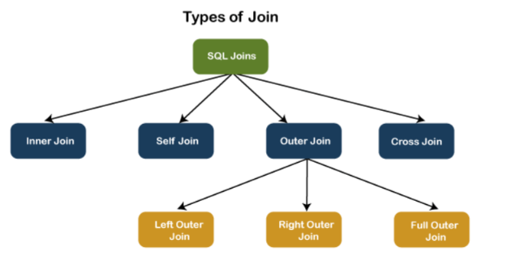

# Queries

## Basics

### Creating Table and Inserting Values

- SQL Queries

```
CREATE TABLE EMPLOYEE (
  empId int primary key,
  name varchar(15) not null,
  dept varchar(10),
  Salary numeric(18,4) not null -- 18 digits before decimal and 4 digits after decimal
);


INSERT INTO EMPLOYEE(empId,name,dept,Salary) VALUES (1, 'Clark', 'Sales',1000),(2, 'Dave', 'Accounting',2000)
, (3, 'Ava', 'Sales',3000),(4, 'ABC', 'Sales',4000),(5, 'BCD', 'Sales',5000),(6, 'XYZ', null,4000.988888);


SELECT * FROM EMPLOYEE; Go
```

- Output:

```
Output:

empId       name            dept       Salary              
----------- --------------- ---------- --------------------
          1 Clark           Sales                 1000.0000
          2 Dave            Accounting            2000.0000
          3 Ava             Sales                 3000.0000
          4 ABC             Sales                 4000.0000
          5 BCD             Sales                 5000.0000
          6 XYZ             NULL                  4000.9889
```

### Adding Foreign Key

- A foreign key is a key whose values are derived from the Primary key of another table.
- The table from which the values are derived is known as **Master or Referenced Table** and the Table in which values are inserted accordingly is known as **Child or Referencing Table**, In other words, we can say that the table containing the foreign key is called the **child table**, and the table containing the Primary key/candidate key is called the **referenced or parent table**.

- SQL Queries

```
-- Child Table
create table gender(
  id int primary key,
  name varchar(7) not null
);

-- Employee Master Table
alter table EMPLOYEE add constraint gender_as_FK foreign key (gender) references gender(id); -- Foreign Key

insert into gender(id,name) VALUES (1,"Male"),(2,"Female"),(3,"Others");

INSERT INTO EMPLOYEE(empId,name,dept,Salary,gender) VALUES (1, 'Clark', 'Sales',1000,1),(2, 'Dave', 'Accounting',2000,1)
, (3, 'Ava', 'Sales',3000,2),(4, 'ABC', 'Sales',4000,3),(5, 'BCD', 'Sales',5000,3),(6, 'XYZ', null,4000.988888,3);

select * from EMPLOYEE;

insert into EMPLOYEE values (7,"ABC",null,100,100); -- Cannot insert 100 because it does not exists in gender table because it has a foreign key relationship
```

- Output

```
Output:

empId       name            dept       Salary               gender     
----------- --------------- ---------- -------------------- -----------
          1 Clark           Sales                 1000.0000           1
          2 Dave            Accounting            2000.0000           1
          3 Ava             Sales                 3000.0000           2
          4 ABC             Sales                 4000.0000           3
          5 BCD             Sales                 5000.0000           3
          6 XYZ             NULL                  4000.9889           3
Msg 547, Level 16, State 1, Server 5a0ee01082d2, Line 33
The INSERT statement conflicted with the FOREIGN KEY constraint "gender_as_FK". The conflict occurred in database "db_42whkr33r_42wj5jgzn", table "dbo.gender", column 'id'.
The statement has been terminated.
```

### Adding default constraint or removing it

- SQL Queries

```
alter table gender add constraint default_value_for_gender default "Not Assigned" for name;
insert into gender(id) values (4);
select * from gender;
```

- Output

```
id          name           
----------- ---------------
          1 Male           
          2 Female         
          3 Others         
          4 Not Assigned  
```

- To remove

```
alter table gender drop constraint default_value_for_gender
```

### Adding or removing a column

- SQL Queries for Adding

```
Alter table to add a new column
alter table employee add phone varchar(20) not null default "Not Provided";
select * from employee;
```

- Output

```
empId       name            dept       Salary               gender      phone               
----------- --------------- ---------- -------------------- ----------- --------------------
          1 Clark           Sales                 1000.0000           1 Not Provided        
          2 Dave            Accounting            2000.0000           1 Not Provided        
          3 Ava             Sales                 3000.0000           2 Not Provided        
          4 ABC             Sales                 4000.0000           3 Not Provided        
          5 BCD             Sales                 5000.0000           3 Not Provided        
          6 XYZ             NULL                  4000.9889           3 Not Provided        
```

- SQL Queries for removing

>[!NOTE]
> - Before removing any column, if the column is associated with any constraint we need to delete that constraint first then delete the column or else we wil receive an error `ALTER TABLE DROP COLUMN phone failed because one or more objects access this column.`

```
alter table employee drop column phone ;
select * from employee;
```

- Output error

```
Msg 5074, Level 16, State 1, Server ba53ca26b538, Line 41
The object 'DF__EMPLOYEE__phone__3B75D760' is dependent on column 'phone'.
Msg 4922, Level 16, State 9, Server ba53ca26b538, Line 41
ALTER TABLE DROP COLUMN phone failed because one or more objects access this column.
```

- Updated query

```
alter table employee drop constraint DF__EMPLOYEE__phone__3B75D760;
alter table employee drop column phone ;
select * from employee
```

- Output

```
empId       name            dept       Salary               gender     
----------- --------------- ---------- -------------------- -----------
          1 Clark           Sales                 1000.0000           1
          2 Dave            Accounting            2000.0000           1
          3 Ava             Sales                 3000.0000           2
          4 ABC             Sales                 4000.0000           3
          5 BCD             Sales                 5000.0000           3
          6 XYZ             NULL                  4000.9889           3
```


### Cascading Referential Integrity OR Referential Integrity

- Referential integrity is usually enforced by creating a foreign key in one table that matches the primary key of another table. **If referential integrity is not enforced, then you may encounter data redundancy and inconsistencies.**
- Consider below SQL Query

```
-- create
CREATE TABLE EMPLOYEE (
  empId int primary key,
  name varchar(15) not null,
  dept varchar(10),
  Salary numeric(18,4) not null,
  gender int
);


create table gender(
  id int primary key,
  name varchar(15)
);

alter table EMPLOYEE add constraint gender_as_FK foreign key (gender) references gender(id);

insert into gender(id,name) VALUES (1,"Male"),(2,"Female"),(3,"Others");


-- insert
INSERT INTO EMPLOYEE(empId,name,dept,Salary,gender) VALUES (1, 'Clark', 'Sales',1000,1),(2, 'Dave', 'Accounting',2000,1)
, (3, 'Ava', 'Sales',3000,2),(4, 'ABC', 'Sales',4000,3),(5, 'BCD', 'Sales',5000,3),(6, 'XYZ', null,4000.988888,3);


alter table gender add constraint default_value_for_gender default "Not Assigned" for name;

select * from EMPLOYEE;
select * from gender;
```

- Output

```
Output:

empId       name            dept       Salary               gender     
----------- --------------- ---------- -------------------- -----------
          1 Clark           Sales                 1000.0000           1
          2 Dave            Accounting            2000.0000           1
          3 Ava             Sales                 3000.0000           2
          4 ABC             Sales                 4000.0000           3
          5 BCD             Sales                 5000.0000           3
          6 XYZ             NULL                  4000.9889           3
id          name           
----------- ---------------
          1 Male           
          2 Female         
          3 Others   
```

- Now suppose you don't create foreign key and you delete any `id` from `gender` table. The corresponding ID's are still present in  `employee` table. This leads to data inconsistencies. You need to manually delete those data from `employee` table. 
- Due to referential integrity, if you try to delete any row from the child table (`gender`) you will get `The DELETE statement conflicted with the REFERENCE constraint "gender_as_FK". The conflict occurred in database "db_42whkr55c_42wjgrfaq", table "dbo.EMPLOYEE", column 'gender'. The statement has been terminated.` such type of error.
- But if you wanna delete the data you need to set some default values or tell SQL Server to these those records from other table as well (`CASCADE`)

#### Setting Default Value

- Consider below SQL Queries

```
-- create
CREATE TABLE EMPLOYEE (
  empId int primary key,
  name varchar(15) not null,
  dept varchar(10),
  Salary numeric(18,4) not null,
  gender int
);


create table gender(
  id int primary key,
  name varchar(15)
);

-- Insert
INSERT INTO EMPLOYEE(empId,name,dept,Salary,gender) VALUES (1, 'Clark', 'Sales',1000,1),(2, 'Dave', 'Accounting',2000,1)
, (3, 'Ava', 'Sales',3000,2),(4, 'ABC', 'Sales',4000,3),(5, 'BCD', 'Sales',5000,3),(6, 'XYZ', null,4000.988888,3);
insert into gender(id,name) VALUES (1,"Male"),(2,"Female"),(3,"Others");

-- Adding foreign key
ALTER TABLE EMPLOYEE
ADD CONSTRAINT gender_as_FK FOREIGN KEY (gender) -- gender column of Employee table
REFERENCES gender(id) -- gender(id) , id column if gender table
ON DELETE SET default;

-- Adding constraint on gender table
alter table gender add constraint default_value_for_gender default "Not Assigned" for name;

-- Adding constraint on employee table's gender column setting some default value for gender column
alter table employee add CONSTRAINT default_gender_id default 3 for gender;

-- Deleting id=1 from gender table
delete from gender where id=1;

select * from gender;
select * from EMPLOYEE;
```

- Here whatever the default value assigned for column `gender` (which is 3 `alter table employee add CONSTRAINT default_gender_id default 3 for gender;`) gets assigned if the Foreign key from the `gender` table is deleted.
- Output

```
Output:

id          name           
----------- ---------------
          2 Female         
          3 Others         
empId       name            dept       Salary               gender     
----------- --------------- ---------- -------------------- -----------
          1 Clark           Sales                 1000.0000           3
          2 Dave            Accounting            2000.0000           3
          3 Ava             Sales                 3000.0000           2
          4 ABC             Sales                 4000.0000           3
          5 BCD             Sales                 5000.0000           3
          6 XYZ             NULL                  4000.9889           3
```

### Setting Default value as `NULL`

- Similarly like above where we assigned 3 as default value, SQL server will assigned directly `NULL` value. You don't need to create default value constraint on `employee` table's `gender` column.

```


-- create
CREATE TABLE EMPLOYEE (
  empId int primary key,
  name varchar(15) not null,
  dept varchar(10),
  Salary numeric(18,4) not null,
  gender int
);


create table gender(
  id int primary key,
  name varchar(15)
);

-- Insert
INSERT INTO EMPLOYEE(empId,name,dept,Salary,gender) VALUES (1, 'Clark', 'Sales',1000,1),(2, 'Dave', 'Accounting',2000,1)
, (3, 'Ava', 'Sales',3000,2),(4, 'ABC', 'Sales',4000,3),(5, 'BCD', 'Sales',5000,3),(6, 'XYZ', null,4000.988888,3);
insert into gender(id,name) VALUES (1,"Male"),(2,"Female"),(3,"Others");

-- Adding foreign key
ALTER TABLE EMPLOYEE
ADD CONSTRAINT gender_as_FK FOREIGN KEY (gender) -- gender column of Employee table
REFERENCES gender(id) -- gender(id) , id column if gender table
ON DELETE SET NULL;

-- Adding constraint on gender table
alter table gender add constraint default_value_for_gender default "Not Assigned" for name;


-- Deleting id=1 from gender table
delete from gender where id=1;

select * from gender;
select * from EMPLOYEE;
```

- Output

```
Output:

id          name           
----------- ---------------
          2 Female         
          3 Others         
empId       name            dept       Salary               gender     
----------- --------------- ---------- -------------------- -----------
          1 Clark           Sales                 1000.0000        NULL
          2 Dave            Accounting            2000.0000        NULL
          3 Ava             Sales                 3000.0000           2
          4 ABC             Sales                 4000.0000           3
          5 BCD             Sales                 5000.0000           3
          6 XYZ             NULL                  4000.9889           3
```

### Delete Cascade

- Lets say when you wanted to remove data from `gender` table but also you want all the related id which corresponds to the data which needs to be deleted, must also be deleted.

```


-- create
CREATE TABLE EMPLOYEE (
  empId int primary key,
  name varchar(15) not null,
  dept varchar(10),
  Salary numeric(18,4) not null,
  gender int
);


create table gender(
  id int primary key,
  name varchar(15)
);

-- Insert
INSERT INTO EMPLOYEE(empId,name,dept,Salary,gender) VALUES (1, 'Clark', 'Sales',1000,1),(2, 'Dave', 'Accounting',2000,1)
, (3, 'Ava', 'Sales',3000,2),(4, 'ABC', 'Sales',4000,3),(5, 'BCD', 'Sales',5000,3),(6, 'XYZ', null,4000.988888,3);
insert into gender(id,name) VALUES (1,"Male"),(2,"Female"),(3,"Others");

-- Adding foreign key
ALTER TABLE EMPLOYEE
ADD CONSTRAINT gender_as_FK FOREIGN KEY (gender) -- gender column of Employee table
REFERENCES gender(id) -- gender(id) , id column if gender table
ON DELETE CASCADE;

-- Adding constraint on gender table
alter table gender add constraint default_value_for_gender default "Not Assigned" for name;


-- Deleting id=1 from gender table
delete from gender where id=1;

select * from gender;
select * from EMPLOYEE;
```

- Output

```
Output:

id          name           
----------- ---------------
          2 Female         
          3 Others         
empId       name            dept       Salary               gender     
----------- --------------- ---------- -------------------- -----------
          3 Ava             Sales                 3000.0000           2
          4 ABC             Sales                 4000.0000           3
          5 BCD             Sales                 5000.0000           3
          6 XYZ             NULL                  4000.9889           3
```

### CHECK Constraint

- A CHECK constraint in SQL Server is used to limit the values that can be entered into a column, ensuring they meet specified conditions. For example, we can use a CHECK constraint to enforce that values in an `age` column must be between `18` and `100`.

```
-- create
CREATE TABLE EMPLOYEE (
  empId int primary key,
  name varchar(15) not null,
  dept varchar(10),
  Salary numeric(18,4) not null,
  gender int
);


-- Add a new column 'age' with a CHECK constraint
ALTER TABLE EMPLOYEE
ADD age INT CHECK (age > 18 AND age < 100);

-- Insert sample data to test the constraint
INSERT INTO EMPLOYEE(empId,name,dept,Salary,gender,age) VALUES (1, 'Clark', 'Sales',1000,1,20);

INSERT INTO EMPLOYEE(empId, name, dept, Salary, gender, age)
VALUES 
(2, 'John', 'Marketing', 2500, 1, 25);

-- Verify the table structure and data
SELECT * FROM EMPLOYEE;

```

- Output

```
Output:

empId       name            dept       Salary               gender      age        
----------- --------------- ---------- -------------------- ----------- -----------
          1 Clark           Sales                 1000.0000           1          20
          2 John            Marketing             2500.0000           1          25
```

- If you try to add value which are beyond the age. You will get error

```
Msg 547, Level 16, State 1, Server 899a7718fee7, Line 21
The INSERT statement conflicted with the CHECK constraint "CK__EMPLOYEE__age__37A5467C". The conflict occurred in database "db_42whkr583_42wjjwthf", table "dbo.EMPLOYEE", column 'age'.
The statement has been terminated.
```

>[!NOTE]
> - Since we have allowed `NULL` values , the `NULL` values will be accepted during any insertion for `age` column.

### Identity Column

- An `IDENTITY` column in SQL Server is used to auto-generate unique numbers for each new row in a table. When you define a column as an IDENTITY, SQL Server automatically assigns an incrementing integer value to it, which can serve as a unique identifier for each row.

```
CREATE TABLE EMPLOYEE (
  empId INT IDENTITY(1,1) PRIMARY KEY,
  name VARCHAR(15) NOT NULL,
  dept VARCHAR(10),
  Salary NUMERIC(18,4) NOT NULL,
  gender INT
);


insert into EMPLOYEE(name,dept,Salary,gender) Values ("ABC","IT",1000,1);

select * from EMPLOYEE;
```

- Output


```
Output:

empId       name            dept       Salary               gender     
----------- --------------- ---------- -------------------- -----------
          1 ABC             IT                    1000.0000           1
```

- When we insert data into `employee` table, we don't need to pass value for `empid` column, it gets automatically generated.
- If you try to enter the value explicitly , you will get an error

```
insert into EMPLOYEE(empId,name,dept,Salary,gender) Values (2,"BCD","IT",1000,1);
```

- Output

```
Cannot insert explicit value for identity column in table 'EMPLOYEE' when IDENTITY_INSERT is set to OFF.
```

- If you wanna explicitly pass on the ID you can use `set IDENTITY_INSERT EMPLOYEE ON;`, **so whenever you are inserting value into the table it won't auto generate unique id, instead it gonna expect id from you**.

```
insert into EMPLOYEE(empId,name,dept,Salary,gender) Values (2,"BCD","IT",1000,1);
```

- Output

```
Output:

empId       name            dept       Salary               gender     
----------- --------------- ---------- -------------------- -----------
          1 ABC             IT                    1000.0000           1
          2 BCD             IT                    1000.0000           1
```

#### Differences Between an Identity Column and a Primary Key


| **Feature**            | **Identity Column**                                         | **Primary Key Column**                                            |
|------------------------|-------------------------------------------------------------|-------------------------------------------------------------------|
| **Purpose**            | Automatically generates a unique numeric value for each row | Enforces uniqueness across rows in the table                      |
| **Auto-increment**     | Yes, it automatically increments by a specified amount      | No, it doesn’t automatically generate values                      |
| **Uniqueness**         | Values are unique if properly defined (no manual inserts)   | Must be unique; allows non-numeric values                         |
| **Required Data Type** | Must be a numeric type (typically INT, BIGINT)              | Can be any data type                                              |
| **Nullability**        | Cannot be null, as it provides unique values                | Cannot be null (required by primary key constraint)               |
| **Usage Flexibility**  | Primarily used for numeric, auto-generated identifiers      | Can be a composite key, combining multiple columns for uniqueness |


>[!NOTE]
> -  A table in SQL Server can only have one `IDENTITY` column. This restriction exists because an IDENTITY column is designed to automatically generate unique values for each new row, which is typically intended to uniquely identify rows in a straightforward, sequential manner.

### Unique Constraint

- There could be scenario where you applied primary key on a table which has employee information like mobile number, aadhar number, email id etc.. So lets say if you applied primary key on mobile number, the uniqueness for email id and aadhar number is still not defined. In such case, you wanted to define uniqueness to email id and aadhar number you can create **unique constraint** on it.

```
alter table EMPLOYEE add email_id varchar(20);

alter table EMPLOYEE add constraint unique_email_id unique (email_id);
```

#### Difference between unique constraint and primary key

| **Feature**                | **UNIQUE Constraint**                                          | **PRIMARY KEY**                               |
|----------------------------|----------------------------------------------------------------|-----------------------------------------------|
| **Purpose**                | Ensures that values are unique across all rows in a column     | Uniquely identifies each row in a table       |
| **Uniqueness Requirement** | Values must be unique, but allows NULL values                  | Must be unique and cannot contain NULL values |
| **NULL Values**            | Allows one NULL per column (some databases may allow multiple) | Does not allow NULL values                    |
| **Number per Table**       | A table can have multiple UNIQUE constraints                   | A table can have only one PRIMARY KEY         |


### Manipulation in Select Queries 

- Lets create a table and insert some values.

```
-- Create a temporary table
CREATE TABLE EmployeeTemp (
    empId INT,
    name VARCHAR(15),
    dept VARCHAR(10),
    salary NUMERIC(18, 2),
    age INT,
    gender CHAR(1)
);

-- Insert sample data into the temporary table
INSERT INTO #EmployeeTemp (empId, name, dept, salary, age, gender)
VALUES 
(1, 'Clark', 'Sales', 1000.50, 25, 'M'),
(2, 'Alice', 'HR', 2000.75, 30, 'F'),
(3, 'Bob', 'Marketing', 1500.25, 35, 'M'),
(4, 'Eve', 'Finance', 2500.00, 28, 'F'),
(5, 'John', 'Sales', 1800.50, 22, 'M');
```

- Display all the data

```
select * from EmployeeTemp;
```

- Output

```
Output:

empId       name            dept       salary               age         gender
----------- --------------- ---------- -------------------- ----------- ------
          1 Clark           Sales                   1000.50          25 M     
          2 Alice           HR                      2000.75          30 F     
          3 Bob             Marketing               1500.25          35 M     
          4 Eve             Finance                 2500.00          28 F     
          5 John            Sales                   1800.50          22 M     
```

- Perform Logical Operation (`AND` or `OR`).

```
-- Select male employees in the Sales department
SELECT * FROM EmployeeTemp WHERE gender = 'M' AND dept = 'Sales';

-- Select employees in Sales or with a salary greater than 2000
SELECT * FROM EmployeeTemp WHERE dept = 'Sales' OR salary > 2000;
```

- Output

```
Output:

empId       name            dept       salary               age         gender
----------- --------------- ---------- -------------------- ----------- ------
          1 Clark           Sales                   1000.50          25 M     
          5 John            Sales                   1800.50          22 M     
empId       name            dept       salary               age         gender
----------- --------------- ---------- -------------------- ----------- ------
          1 Clark           Sales                   1000.50          25 M     
          2 Alice           HR                      2000.75          30 F     
          4 Eve             Finance                 2500.00          28 F     
          5 John            Sales                   1800.50          22 M     
```

- Using `!=` and `<>` (Not Equal)

```
-- Select employees who are not in the Sales department
SELECT * FROM EmployeeTemp WHERE dept != 'Sales';

-- Alternative syntax
SELECT * FROM EmployeeTemp WHERE dept <> 'Sales';
```

- Output

```
Output:

empId       name            dept       salary               age         gender
----------- --------------- ---------- -------------------- ----------- ------
          2 Alice           HR                      2000.75          30 F     
          3 Bob             Marketing               1500.25          35 M     
          4 Eve             Finance                 2500.00          28 F     
empId       name            dept       salary               age         gender
----------- --------------- ---------- -------------------- ----------- ------
          2 Alice           HR                      2000.75          30 F     
          3 Bob             Marketing               1500.25          35 M     
          4 Eve             Finance                 2500.00          28 F     
```

- Finding a range using `BETWEEN`

```
-- Select employees with age between 25 and 30
SELECT * FROM EmployeeTemp WHERE age BETWEEN 25 AND 30;
```

- Output

```
Output:

empId       name            dept       salary               age         gender
----------- --------------- ---------- -------------------- ----------- ------
          1 Clark           Sales                   1000.50          25 M     
          2 Alice           HR                      2000.75          30 F     
          4 Eve             Finance                 2500.00          28 F     
```

- Find those rows which existing in the group of values


```
-- Select employees in the Sales or HR departments
SELECT * FROM EmployeeTemp WHERE dept IN ('Sales', 'HR');
```

- Output

```
Output:

empId       name            dept       salary               age         gender
----------- --------------- ---------- -------------------- ----------- ------
          1 Clark           Sales                   1000.50          25 M     
          2 Alice           HR                      2000.75          30 F     
          5 John            Sales                   1800.50          22 M     
```

- Using greater than or less than or greater than/less than and equal to

```
-- Select employees with a salary greater than 1500
SELECT * FROM EmployeeTemp WHERE salary > 1500;

-- Select employees with an age less than 30 and equal to 30
SELECT * FROM EmployeeTemp WHERE age <= 30;
```

- Output

```
Output:

empId       name            dept       salary               age         gender
----------- --------------- ---------- -------------------- ----------- ------
          2 Alice           HR                      2000.75          30 F     
          3 Bob             Marketing               1500.25          35 M     
          4 Eve             Finance                 2500.00          28 F     
          5 John            Sales                   1800.50          22 M     
empId       name            dept       salary               age         gender
----------- --------------- ---------- -------------------- ----------- ------
          1 Clark           Sales                   1000.50          25 M     
          2 Alice           HR                      2000.75          30 F     
          4 Eve             Finance                 2500.00          28 F     
          5 John            Sales                   1800.50          22 M     
```

- Pattern matching

```
-- Select employees whose name starts with 'C'
SELECT * FROM EmployeeTemp WHERE name LIKE 'C%';

-- Select employees whose department ends with 'e'
SELECT * FROM EmployeeTemp WHERE dept LIKE '%e';

-- Select employees whose department contains `a`
SELECT * FROM EmployeeTemp WHERE dept LIKE '%a%';
```

- Output

```
Output:

empId       name            dept       salary               age         gender
----------- --------------- ---------- -------------------- ----------- ------
          1 Clark           Sales                   1000.50          25 M     
empId       name            dept       salary               age         gender
----------- --------------- ---------- -------------------- ----------- ------
          4 Eve             Finance                 2500.00          28 F     
empId       name            dept       salary               age         gender
----------- --------------- ---------- -------------------- ----------- ------
          1 Clark           Sales                   1000.50          25 M     
          3 Bob             Marketing               1500.25          35 M     
          4 Eve             Finance                 2500.00          28 F     
          5 John            Sales                   1800.50          22 M     
```

- The `%` character is use to find one or more character after or before the specified character.
- The `_` character is use to find exactly one character after or before the specified character.

```
-- Select employees whose department has one word before `R`, so `HR`
SELECT * FROM EmployeeTemp WHERE dept LIKE '_R';

-- Select employees whose department has one word before `a` and any or zero characters after `a`'
SELECT * FROM EmployeeTemp WHERE dept LIKE '_a%';
```

- Output

```
Output:

empId       name            dept       salary               age         gender
----------- --------------- ---------- -------------------- ----------- ------
          2 Alice           HR                      2000.75          30 F     
empId       name            dept       salary               age         gender
----------- --------------- ---------- -------------------- ----------- ------
          1 Clark           Sales                   1000.50          25 M     
          3 Bob             Marketing               1500.25          35 M     
          5 John            Sales                   1800.50          22 M     
```

- The `[]` represents any single character within the brackets 
- The `[^]` represents any character not in the brackets

```
-- Select employees whose department start with `Sa`
SELECT * FROM EmployeeTemp WHERE dept LIKE '[Sa]%';


-- Select employees whose department does not start with `Sa`
SELECT * FROM EmployeeTemp WHERE dept LIKE '[^Sa]%';
```

- Output

```
Output:

empId       name            dept       salary               age         gender
----------- --------------- ---------- -------------------- ----------- ------
          1 Clark           Sales                   1000.50          25 M     
          5 John            Sales                   1800.50          22 M     
empId       name            dept       salary               age         gender
----------- --------------- ---------- -------------------- ----------- ------
          2 Alice           HR                      2000.75          30 F     
          3 Bob             Marketing               1500.25          35 M     
          4 Eve             Finance                 2500.00          28 F     
```

- Sorting

```
-- Select employees by sorting in ascending order of name
SELECT * FROM EmployeeTemp order by name;

-- Select employees by sorting in descending order of name
SELECT * FROM EmployeeTemp order by name desc;
```

- Output

```
Output:

empId       name            dept       salary               age         gender
----------- --------------- ---------- -------------------- ----------- ------
          2 Alice           HR                      2000.75          30 F     
          3 Bob             Marketing               1500.25          35 M     
          1 Clark           Sales                   1000.50          25 M     
          4 Eve             Finance                 2500.00          28 F     
          5 John            Sales                   1800.50          22 M     
empId       name            dept       salary               age         gender
----------- --------------- ---------- -------------------- ----------- ------
          5 John            Sales                   1800.50          22 M     
          4 Eve             Finance                 2500.00          28 F     
          1 Clark           Sales                   1000.50          25 M     
          3 Bob             Marketing               1500.25          35 M     
          2 Alice           HR                      2000.75          30 F     
```

- Fetch top 1st row

```
-- Select Top 1
SELECT TOP 1 * FROM EmployeeTemp;

-- Select TOP 50% data from table (5/2+1=3 rows)
SELECT TOP 50 percent * FROM EmployeeTemp;
```

- Output

```
Output:

empId       name            dept       salary               age         gender
----------- --------------- ---------- -------------------- ----------- ------
          1 Clark           Sales                   1000.50          25 M     
empId       name            dept       salary               age         gender
----------- --------------- ---------- -------------------- ----------- ------
          1 Clark           Sales                   1000.50          25 M     
          2 Alice           HR                      2000.75          30 F     
          3 Bob             Marketing               1500.25          35 M    
```

### Aggregate Functions

- An aggregate function is a function that performs a calculation on a set of values, and returns a single value.
- Aggregate functions are often used with the `GROUP BY` clause of the `SELECT` statement. The `GROUP BY` clause splits the result-set into groups of values and the aggregate function can be used to return a single value for each group.

```
-- Select average salary given for gender (M & F)
select gender,avg(salary) from EmployeeTemp group by gender;

-- Select max salary given for gender (M & F)
select gender,max(salary) from EmployeeTemp group by gender;

-- Select min salary given for gender (M & F)
select gender,min(salary) from EmployeeTemp group by gender;

-- Select sum of salary given for gender (M & F)
select gender,sum(salary) from EmployeeTemp group by gender;


-- Find the number of genders
select gender,count(gender) from EmployeeTemp group by gender;

```

- Output

```
Output:

gender                                         
------ ----------------------------------------
F                                   2250.375000
M                                   1433.750000
gender                     
------ --------------------
F                   2500.00
M                   1800.50
gender                     
------ --------------------
F                   2000.75
M                   1000.50
gender                                         
------ ----------------------------------------
F                                       4500.75
M                                       4301.25
gender            
------ -----------
F                2
M                3
```

>[!NOTE]
> - Aggregate functions ignore `NULL` values (except for `COUNT()` function).

#### Having and Where clause

- Consider below queries

```
CREATE TABLE Sales (
    sale_id INT,
    item VARCHAR(20),
    quantity INT,
    price DECIMAL(10, 2),
    department VARCHAR(20)
);

-- Insert sample data
INSERT INTO Sales (sale_id, item, quantity, price, department)
VALUES
(1, 'Laptop', 2, 1200.00, 'Electronics'),
(2, 'TV', 1, 800.00, 'Electronics'),
(3, 'Shoes', 3, 100.00, 'Clothing'),
(4, 'Jacket', 1, 150.00, 'Clothing'),
(5, 'Laptop', 1, 1200.00, 'Electronics'),
(6, 'Laptop', 1, 1200.00, 'Electronics');


-- Group by departments
SELECT department, SUM(quantity) AS total_quantity
FROM Sales
GROUP BY department;

-- Select those rows, first perform group by then filter than on it using having clause
SELECT department, SUM(quantity) AS total_quantity
FROM Sales
GROUP BY department
having sum(quantity)>4;
```

- Output

```
Output:

department           total_quantity
-------------------- --------------
Clothing                          4
Electronics                       5
department           total_quantity
-------------------- --------------
Electronics                       5
```

- If we want to first filter out certain rows (using `WHERE`) and then apply aggregation conditions (using `HAVING`), we can combine both clauses.
- `HAVING` Clause:
  - Filters after aggregation has taken place.
  - Applies conditions to aggregated results (e.g., groups created by GROUP BY).
  - Typically used with aggregate functions.
- `WHERE` Clause:
  - Filters rows before any aggregation occurs.
  - Applies conditions to individual rows.
  - Cannot use aggregate functions directly (E.g `select * from Sales where sum(quantity)>4` this is invalid because we can't use `sum` aggregate function directly in `WHERE` clause)


### Joins

- The join clause allows us to retrieve data from two or more related tables into a meaningful result set. We can join the table using a SELECT statement and a join condition. It indicates how SQL Server can use data from one table to select rows from another table.
- Consider below query

```
-- Employee table
CREATE TABLE Employee (
    empId INT,
    name VARCHAR(15),
    deptId INT
);

INSERT INTO Employee (empId, name, deptId)
VALUES
(1, 'Clark', 101),
(2, 'Alice', 102),
(3, 'Bob', NULL),
(4, 'Eve', 104);

-- Department table
CREATE TABLE Department (
    deptId INT,
    deptName VARCHAR(15)
);

INSERT INTO Department (deptId, deptName)
VALUES
(101, 'Sales'),
(102, 'HR'),
(103, 'IT');

select * from Employee;
select * from Department;
```

- Output

```
Output:

empId       name            deptId     
----------- --------------- -----------
          1 Clark                   101
          2 Alice                   102
          3 Bob                    NULL
          4 Eve                     104
deptId      deptName       
----------- ---------------
        101 Sales          
        102 HR             
        103 IT  
```

#### INNER JOIN

- An INNER JOIN returns rows when there is a match in both tables. If no match is found, the row is excluded.

```
SELECT e.empId, e.name, d.deptName
FROM Employee e
INNER JOIN Department d ON e.deptId = d.deptId;
```

- Output

```
Output:

empId       name            deptName       
----------- --------------- ---------------
          1 Clark           Sales          
          2 Alice           HR    
```

#### LEFT JOIN or LEFT OUTER JOIN

- A LEFT JOIN (or LEFT OUTER JOIN) returns all rows from the left table and the matched rows from the right table. If there is no match, `NULL` values are returned for columns from the right table.

```
SELECT e.empId, e.name, d.deptName
FROM Employee e
LEFT JOIN Department d ON e.deptId = d.deptId;
```

- Output

```
Output:

empId       name            deptName       
----------- --------------- ---------------
          1 Clark           Sales          
          2 Alice           HR             
          3 Bob             NULL           
          4 Eve             NULL  
```

#### RIGHT JOIN or RIGHT OUTER JOIN

- A RIGHT JOIN (or RIGHT OUTER JOIN) returns all rows from the right table and the matched rows from the left table. If there is no match, `NULL` values are returned for columns from the left table.

```
SELECT e.empId, e.name, d.deptName
FROM Employee e
RIGHT JOIN Department d ON e.deptId = d.deptId;
```

- Output

```
Output:

empId       name            deptName       
----------- --------------- ---------------
          1 Clark           Sales          
          2 Alice           HR             
       NULL NULL            IT             
```

#### FULL JOIN or FULL OUTER JOIN

- A FULL JOIN (or FULL OUTER JOIN) returns all rows when there is a match in either the left or right table. Rows that do not have matches in either table will contain `NULL` values for the missing data.

```
SELECT e.empId, e.name, d.deptName
FROM Employee e
FULL JOIN Department d ON e.deptId = d.deptId;
```

- Output

```
Output:

empId       name            deptName       
----------- --------------- ---------------
          1 Clark           Sales          
          2 Alice           HR             
          3 Bob             NULL           
          4 Eve             NULL           
       NULL NULL            IT  
```

#### CROSS JOIN

- A CROSS JOIN combines every row from one table with every row from another table, regardless of any relationship or matching condition. Think of it as pairing each item in the first table with every item in the second table, producing a Cartesian product.
- Let’s say you have two tables with data:

| empId | name  |
|-------|-------|
| 1     | Clark |
| 2     | Ava   |


- Another table

| deptId | deptName |
|--------|----------|
| 101    | Sales    |
| 102    | HR       |

- When you CROSS JOIN these tables, you get every possible combination

| empId | name  | deptId | deptName |
|-------|-------|--------|----------|
| 1     | Clark | 101    | Sales    |
| 1     | Clark | 102    | HR       |
| 2     | Ava   | 101    | Sales    |

- Query

```
SELECT e.empId, e.name, d.deptId, d.deptName
FROM Employee e
CROSS JOIN Department d;
```

- Output

```
Output:

empId       name            deptId      deptName       
----------- --------------- ----------- ---------------
          1 Clark                   101 Sales          
          2 Alice                   101 Sales          
          3 Bob                     101 Sales          
          4 Eve                     101 Sales          
          1 Clark                   102 HR             
          2 Alice                   102 HR             
          3 Bob                     102 HR             
          4 Eve                     102 HR             
          1 Clark                   103 IT             
          2 Alice                   103 IT             
          3 Bob                     103 IT             
          4 Eve                     103 IT   
```

#### SELF JOIN

- A SELF JOIN is when a table is joined with itself. This can be helpful when you need to compare rows in a single table. For example, if you want to find pairs of employees from the same department, you can join the Employee table with itself.
- A self join is a regular join, but the table is joined with itself.
- Suppose we have a company with employees who might have managers.

```
CREATE TABLE Employee (
    empId INT PRIMARY KEY,
    name VARCHAR(50) NOT NULL,
    managerId INT NULL,
    FOREIGN KEY (managerId) REFERENCES Employee(empId)  -- Self-referencing foreign key
);

INSERT INTO Employee (empId, name, managerId) VALUES
(1, 'Clark', NULL),  -- Clark is the top-level manager (CEO)
(2, 'Ava', 1),       -- Ava reports to Clark
(3, 'Bob', 1),       -- Bob reports to Clark
(4, 'Eve', 2),       -- Eve reports to Ava
(5, 'David', 2),     -- David reports to Ava
(6, 'Mary', 3);      -- Mary reports to Bob


select * from Employee;

SELECT 
    e1.empId AS EmployeeId,
    e1.name AS EmployeeName,
    e2.empId AS ManagerId,
    e2.name AS ManagerName
FROM 
    Employee e1
 JOIN 
    Employee e2 ON e1.managerId = e2.empId;
```

- Output

```
Output:

empId       name                                               managerId  
----------- -------------------------------------------------- -----------
          1 Clark                                                     NULL
          2 Ava                                                          1
          3 Bob                                                          1
          4 Eve                                                          2
          5 David                                                        2
          6 Mary                                                         3
EmployeeId  EmployeeName                                       ManagerId   ManagerName                                       
----------- -------------------------------------------------- ----------- --------------------------------------------------
          2 Ava                                                          1 Clark                                             
          3 Bob                                                          1 Clark                                             
          4 Eve                                                          2 Ava                                               
          5 David                                                        2 Ava                                               
          6 Mary                                                         3 Bob                                               
```




### Different Ways to Replace `NULL`

#### ISNULL

- Using `ISNULL()` function you can query output and given some value to it. `ISNULL` takes two arguments. If the first argument is NULL, it returns the second argument; otherwise, it returns the first argument


```

-- create
CREATE TABLE EMPLOYEE (
  empId int,
  first_name varchar(15),
  middle_name varchar(15),
  last_name varchar(15),
  dept varchar(10),
);

-- insert
INSERT INTO EMPLOYEE(empId,first_name,middle_name,last_name,dept) VALUES (1, 'Clark', "A", "Mark",'Sales');
INSERT INTO EMPLOYEE(empId,first_name,middle_name,last_name,dept) VALUES (2, 'Dave', "B", "Ford",'Accounting');
INSERT INTO EMPLOYEE(empId,first_name,middle_name,last_name,dept) VALUES (3, 'Ava', "C", "Ambani",'Sales');
INSERT INTO EMPLOYEE(empId,first_name,middle_name,last_name,dept) VALUES (4, NULL, "C", "Ambani",'Sales');
INSERT INTO EMPLOYEE(empId,first_name,middle_name,last_name,dept) VALUES (5, 'Ava', NULL, "Ambani",'Sales');
INSERT INTO EMPLOYEE(empId,first_name,middle_name,last_name,dept) VALUES (6, 'Ava', "C", NULL,'Sales');


-- fetch 
SELECT ISNULL(first_name,"first name not given") FROM EMPLOYEE;
GO
```

- Output

```
Output:

               
---------------
Clark          
Dave           
Ava            
first name not 
Ava            
Ava            
```

#### COALESCE

- COALESCE can take multiple arguments and returns the first non-NULL value in the list. It's useful when you want to check several columns for `NULL` values.

- Consider below query

```

-- create
CREATE TABLE EMPLOYEE (
  empId int,
  first_name varchar(15),
  middle_name varchar(15),
  last_name varchar(15),
  dept varchar(10),
);

-- insert
INSERT INTO EMPLOYEE(empId,first_name,middle_name,last_name,dept) VALUES (1, 'Clark', "A", "Mark",'Sales');
INSERT INTO EMPLOYEE(empId,first_name,middle_name,last_name,dept) VALUES (2, 'Dave', "B", "Ford",'Accounting');
INSERT INTO EMPLOYEE(empId,first_name,middle_name,last_name,dept) VALUES (3, 'Ava', "C", "Ambani",'Sales');
INSERT INTO EMPLOYEE(empId,first_name,middle_name,last_name,dept) VALUES (4, NULL, "C", "Ambani",'Sales');
INSERT INTO EMPLOYEE(empId,first_name,middle_name,last_name,dept) VALUES (5, 'Ava', NULL, "Ambani",'Sales');
INSERT INTO EMPLOYEE(empId,first_name,middle_name,last_name,dept) VALUES (6, 'Ava', "C", NULL,'Sales');


-- fetch 
SELECT coalesce(first_name,"first name not given") FROM EMPLOYEE;
GO
```

- Output

```
Output:

                    
--------------------
Clark               
Dave                
Ava                 
first name not given
Ava                 
Ava
```

- Lets say you wanna name, if first name is null, then consider middle name, if middle name is null then consider last name, in such scenario you can pass multiple columns as argument in `COALESCE` function
- Consider below query 

```

-- create
CREATE TABLE EMPLOYEE (
  empId int,
  first_name varchar(15),
  middle_name varchar(15),
  last_name varchar(15),
  dept varchar(10),
);

-- insert
INSERT INTO EMPLOYEE(empId,first_name,middle_name,last_name,dept) VALUES (1, 'Clark', "A", "Mark",'Sales');
INSERT INTO EMPLOYEE(empId,first_name,middle_name,last_name,dept) VALUES (2, 'Dave', "B", "Ford",'Accounting');
INSERT INTO EMPLOYEE(empId,first_name,middle_name,last_name,dept) VALUES (3, 'Ava', "C", "Ambani",'Sales');
INSERT INTO EMPLOYEE(empId,first_name,middle_name,last_name,dept) VALUES (4, NULL, "C", "Ambani",'Sales');
INSERT INTO EMPLOYEE(empId,first_name,middle_name,last_name,dept) VALUES (5, NULL, NULL, "Ambani",'Sales');
INSERT INTO EMPLOYEE(empId,first_name,middle_name,last_name,dept) VALUES (6, NULL, NULL, NULL,'Sales');


-- fetch 
SELECT coalesce(first_name,middle_name,last_name,"name not given") FROM EMPLOYEE;
GO
```

- Output 


```
Output:

               
---------------
Clark          
Dave           
Ava            
C              
Ambani         
name not given 
```

#### CASE statement

- The `CASE` statement provides more flexibility by allowing complex conditions. It's generally slower than `ISNULL` and `COALESCE` because of the conditional logic.

```

-- create
CREATE TABLE EMPLOYEE (
  empId int,
  first_name varchar(15),
  middle_name varchar(15),
  last_name varchar(15),
  dept varchar(10),
);

-- insert
INSERT INTO EMPLOYEE(empId,first_name,middle_name,last_name,dept) VALUES (1, 'Clark', "A", "Mark",'Sales');
INSERT INTO EMPLOYEE(empId,first_name,middle_name,last_name,dept) VALUES (2, 'Dave', "B", "Ford",'Accounting');
INSERT INTO EMPLOYEE(empId,first_name,middle_name,last_name,dept) VALUES (3, 'Ava', "C", "Ambani",'Sales');
INSERT INTO EMPLOYEE(empId,first_name,middle_name,last_name,dept) VALUES (4, NULL, "C", "Ambani",'Sales');
INSERT INTO EMPLOYEE(empId,first_name,middle_name,last_name,dept) VALUES (5, NULL, NULL, "Ambani",'Sales');
INSERT INTO EMPLOYEE(empId,first_name,middle_name,last_name,dept) VALUES (6, NULL, NULL, NULL,'Sales');


-- fetch 
SELECT case

  When first_name is null then "first name not given"
  else
    first_name
End as result
FROM EMPLOYEE;
GO
```

- Output

```
Output:

result              
--------------------
Clark               
Dave                
Ava                 
first name not given
first name not given
first name not given
```

### UNION and UNION ALL 

- The `UNION` and `UNION ALL` operators are used to combine the results of two or more SELECT statements in SQL Server.
- `UNION`:
  - Removes duplicate rows from the result set.
  - Performs a sorting operation to ensure unique rows, which can make it slower for large datasets.
- `UNION ALL`:
  - Does not remove duplicates, so it is faster because it skips the sorting step.
  - Includes all rows from the combined result sets, including duplicates.


```
-- Create two tables
CREATE TABLE TableA (
    ID INT,
    Name VARCHAR(50)
);

CREATE TABLE TableB (
    ID INT,
    Name VARCHAR(50)
);

-- Insert values into TableA
INSERT INTO TableA (ID, Name) VALUES
(1, 'Alice'),
(2, 'Bob'),
(3, 'Charlie');

-- Insert values into TableB
INSERT INTO TableB (ID, Name) VALUES
(2, 'Bob'),
(3, 'Charlie'),
(4, 'David');

/*
  union
*/

SELECT ID, Name FROM TableA
UNION
SELECT ID, Name FROM TableB;

/*
  union all
*/
SELECT ID, Name FROM TableA
UNION ALL
SELECT ID, Name FROM TableB;
```

- Output

```
Output:

ID          Name                                              
----------- --------------------------------------------------
          1 Alice                                             
          2 Bob                                               
          3 Charlie                                           
          4 David                                             
ID          Name                                              
----------- --------------------------------------------------
          1 Alice                                             
          2 Bob                                               
          3 Charlie                                           
          2 Bob                                               
          3 Charlie                                           
          4 David  
```

## Stored Procedure

- In SQL Server, a Stored Procedure is a collection of SQL statements and control-of-flow logic, stored in the database and executed as a single batch. Stored procedures can accept input parameters, output parameters, and even return values, making them flexible and powerful tools for encapsulating database operations.
- Lets create a table and insert some values into it

```
create table test(
id int ,
name varchar(15),
dept varchar(15));

insert into test(id,name,dept) values (1,'A','IT'), (2,'B','IT');
```

- Lets create and execute a simple procedure

```
/* Creating Procedure */
CREATE PROCEDURE testProc
AS
BEGIN
    SELECT * FROM test;
END;

/* Execute Procedure */
execute testProc;
```

- Output

```
id	name	dept
1	A	IT
2	B	IT
```

- Alter procedure

```
Alter PROCEDURE testProc
AS
BEGIN
    SELECT name FROM test;
END;

execute testProc;
```

- Procedure taking inputs

```
Alter PROCEDURE testProc 

@Name varchar(16),
@ID int

AS
BEGIN
    SELECT name FROM test where name=@Name and id=@ID;
END;

exec testProc @Name='A' , @ID=1;
```

- Output

```
name
A
```

- Procedure providing Output

```
Alter PROCEDURE testProc 

@Name varchar(16) , -- default inputs or you can Specify IN
@ID int,
@DeptName varchar(16) OUT

AS
BEGIN
    SELECT @DeptName=dept FROM test where name=@Name and id=@ID;
END;

declare @DepartName varchar(16);
exec testProc @Name='A' , @ID=1, @DeptName=@DepartName OUTPUT;

PRINT @DepartName;
```

- Output

```
IT
```


